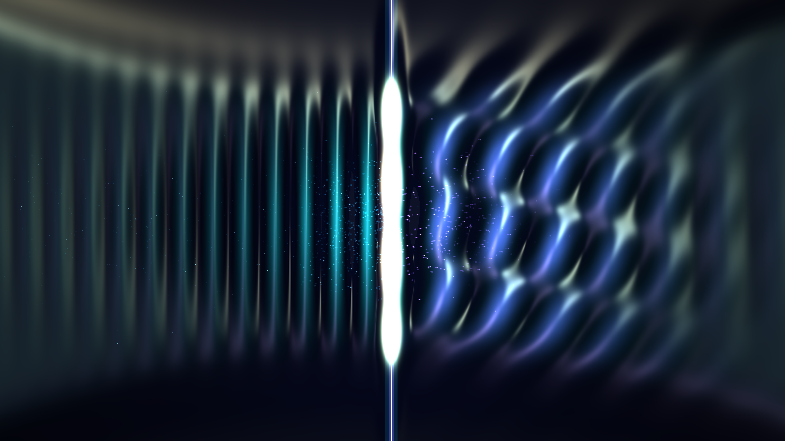

# kinetic_acoustic_black_hole_hawking_radiation_2d

A 15-second kinetic media art piece exploring analogue gravity: an acoustic black hole (dumb hole) realized within a transonic fluid flow through a de Laval nozzle, exhibiting the acoustic counterpart of Hawking radiation and Bogoliubov phonon pair creation.

## Concept & Physics

In 1981, William Unruh demonstrated that sound waves propagating within an inhomogeneous moving fluid obey the same differential equations as a scalar field in curved spacetime. When fluid velocity $v(x)$ accelerates from subsonic ($v < c_s$) to supersonic ($v > c_s$), sound waves can no longer propagate upstream against the supersonic current. The critical surface where $v(x) = c_s$ forms a **sonic event horizon** (acoustic black hole).

At this acoustic horizon, quantum fluctuations in the fluid condense into entangled phonon pairs through anomalous dispersion:
1. **Escaping Hawking Phonons**: Propagate upstream into the subsonic exterior, dispersive wavepackets whose wavelengths stretch as they outrun the horizon.
2. **Infalling Partner Phonons**: Swept irreversibly downstream into the supersonic interior ($v > c_s$), exhibiting extreme Doppler blueshift and spatial frequency compression as they are advected away.

## Visual Dynamics

- **Transonic Waveguide**: A curved de Laval nozzle constricts the flow, driving flow velocity across Mach 1.
- **Sonic Horizon Blade**: A piercing quantum luminescence marking the Mach 1 transition layer.
- **Dual Wave Regimes**: High-frequency compressed planar waves in the supersonic left, intersecting interference ripples and dispersive Bogoliubov wavepackets in the subsonic right.
- **Micro-cavitation Phonon Pairs**: Entangled acoustic quanta emitted from the horizon interface and dragged along asymmetric flow trajectories.

## Color Palette

- **Subsonic Horizon Luminescence** (`#f0fdff`, `#4ef0ff`): Intense horizon emission and quantum phonon pairs (10%).
- **Acoustic Wave Crests** (`#2a4b7c`, `#4a6fa5`, `#1b2a4a`): Fluid pressure oscillations, Bogoliubov wave crests, and specular reflections (30%).
- **Abyssal Fluid Background** (`#03060f`, `#070c18`): Deep non-reflective acoustic absorption medium (60%).

## Technical Implementation

- **Platform**: py5 (Python Processing architecture)
- **Fluid & Wave Mechanics**: Coupled 2D hydrodynamic wave equation with spatially varying advection velocity $v(x)\hat{x}$ and Bogoliubov dispersion $\omega^2 = c_s^2 k^2 + (\hbar/2m)^2 k^4$.
- **Surface Optics**: Blinn-Phong specular normal mapping computed directly from pressure field gradients $\nabla H$.
- **Output**: 1920×1080 @ 60fps (900 frames, 15 seconds), H.264 video.
