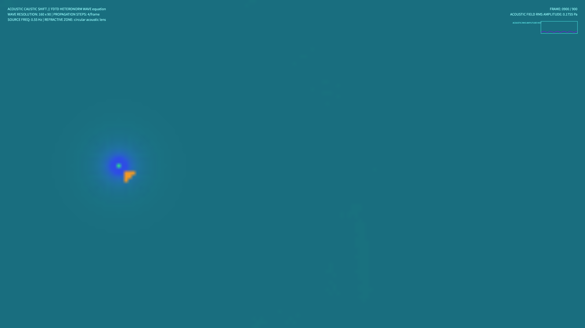

# kinetic_acoustic_lens_refraction_2d

## Metadata
- **Date**: 2026-08-14
- **Theme**: Sound waves travelling through a shifting thermal ocean front, bending and focusing into glowing ribbons of light.
- **Technique**: 2D FDTD Wave Equation solver with spatially varying sound speed $c(x, y)$.
- **Logic Lab Reference**: None

## Concept
A computational wave mechanics visualization illustrating refraction and caustics. It simulates continuous acoustic wave emission from a point source in a 2D ocean basin. Spatially varying sound speed $c(x, y)$ represents a moving circular thermal lens front, dynamically modulated by slow Perlin noise. The wave front refracts, bends, slows down, and focuses into high-amplitude caustics. These wave heights are shaded using normal mapping and specular reflection, mapping wave phases to cyan-indigo-amber gradients.

## Technical Details
- **Renderer**: P2D
- **Simulation**: Explicit finite-difference time-domain (FDTD) updates of the 2D Wave Equation on a 160x90 grid, upscaled to 4K.
- **Visuals**: Curvature-based Blinn-Phong specular caustics shading, normal vectors gradient mapping, HSB color wheel phase mapping, and additive blending (`py5.ADD`).
- **Animation**: 15 seconds @ 60fps (900 frames total). Includes real-time acoustic field RMS amplitude telemetry HUD.
