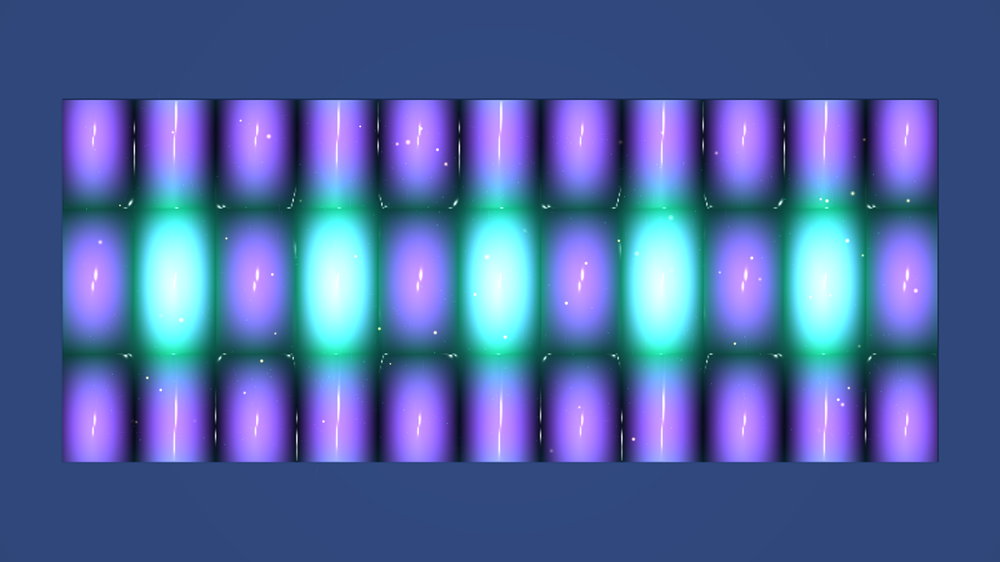

# kinetic_acoustic_radiation_acoustophoresis_2d

A 15-second kinetic media art visualization of ultrasonic microfluidics and acoustophoresis: 2D acoustic standing wavefield resonance, Gor'kov acoustic radiation potential gradients ($\vec{F}_{rad} = -\nabla U$), boundary-layer Rayleigh acoustic streaming micro-vortices, dual-contrast particle separation, and crystalline quartz surface optics.

## Concept & Physics

In microfluidic ultrasonic resonators (acoustophoresis), piezoelectric transducers drive high-frequency acoustic standing waves across a microchannel, generating two distinct physical phenomena:

1. **Acoustic Radiation Force (Primary Radiation Force)**:
   Scattered ultrasound waves impart an acoustic radiation force onto suspended particles, governed by the Gor'kov potential $U$:
   $$\vec{F}_{rad} = -\nabla U$$
   $$U = V_p \left[ \frac{f_1}{2 \rho_0 c_0^2} \langle p_1^2 \rangle - \frac{3 f_2}{4} \rho_0 \langle v_1^2 \rangle \right]$$
   - **Positive Acoustic Contrast ($\Phi > 0$)**: Dense microbeads and cells are driven to the acoustic pressure nodal planes ($p_1 = 0$), focusing into razor-sharp ribbons.
   - **Negative Acoustic Contrast ($\Phi < 0$)**: Less dense lipid droplets and vesicles are repelled toward the pressure antinodes.

2. **Rayleigh Acoustic Streaming (Secondary Hydrodynamic Vortices)**:
   Viscous dissipation within the acoustic boundary layer at the microchannel walls drives steady, time-averaged fluid recirculation eddies (Rayleigh streaming):
   $$\psi_s(x, y) \propto -\sin(2 k_x x) \sin(2 k_y y)$$
   forming a regular 2D lattice of four-quadrant counter-rotating micro-vortices that entrain smaller particles into swirling whirlpools between the nodal lines.

## Visual Dynamics

- **Ultrasonic Nodal Bands**: Luminous fluorescent jade green and glacial mint standing wave ribbons spanning the microchannel.
- **Rayleigh Streaming Vortices**: Electric violet and deep iris swirling streamlines circulating in four-quadrant symmetry.
- **Dual-Contrast Particle Sorting**: Positive-contrast beads focusing sharply along the nodal axes while negative-contrast particles orbit in swirling streaming eddies.
- **Specular Quartz Microchannel Rails**: Dual-light Blinn-Phong chrome highlights defining the crystalline quartz chip walls.

## Color Palette

- **Ultrasonic Pressure Nodes** (`#00ff9d`, `#80ffcc`): Standing wave nodal planes in fluorescent jade green and glacial mint (60%).
- **Rayleigh Streaming Eddies** (`#7b2cbf`, `#9d4edd`): Acoustic streaming whirlpools in electric violet and deep iris (30%).
- **Focused Particle Beads & Cavitation Sparks** (`#ffffff`, `#ffb703`): Trapped focus lines and acoustic pressure glints in diamond-white and solar amber (10%).
- **Quartz Microchannel Void** (`#030810`, `#0a1828`): Deep tourmaline obsidian and midnight slate.

## Technical Implementation

- **Platform**: py5 (Python Processing architecture)
- **Acoustic Wave & Streaming Mechanics**: 2D standing acoustic pressure field formulation, Gor'kov radiation force field derivation, and boundary-layer Rayleigh acoustic streaming streamfunction $\psi_s$.
- **Surface Optics**: Blinn-Phong specular quartz normal shading $\vec{N} = (-\nabla H, 1.0)$.
- **Particles**: Lagrangian dual-contrast microbeads with additive blending (`ADD`).
- **Output**: 3840×2160 / 1920×1080 @ 60fps (900 frames, 15 seconds), H.264 video.
