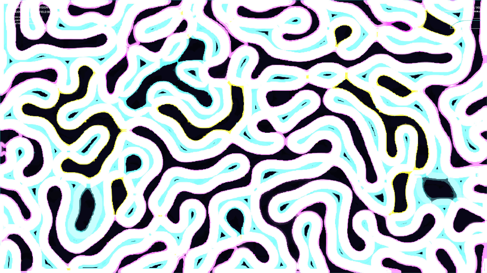

# kinetic_active_cahn_hilliard_division_2d

## Metadata
- **Date**: 2026-08-16
- **Theme**: Bioluminescent cells replicating and dividing under chemical pressure, a self-sustaining cycle of birth and division in a deep fluid abyss.
- **Technique**: Vectorized 2D Cahn-Hilliard equation coupled with a local chemical reaction term representing production/consumption (active phase separation).
- **Logic Lab Reference**: None

## Concept
This work visualizes biological replication dynamics by coupling Cahn-Hilliard thermodynamic phase separation with a negative feedback chemical reaction term (active phase separation). Instead of merging into a single massive domain, droplets split into smaller structures upon exceeding a size threshold, creating a continuous pattern of cellular division. Glowing amethyst, turquoise, and saffron contours highlight the cell boundaries against an oceanic void.

## Technical Details
- **Renderer**: P2D
- **Simulation**: Vectorized 2D NumPy Cahn-Hilliard finite difference solver (dx=1.0, dy=1.0, dt=0.04) with sub-stepping (5 steps/frame) and periodic wrapping.
- **Visuals**: HSB phase mapping, OpenCV contour rendering, and fading trails.
- **Animation**: 15s @ 60fps (900 frames total)
