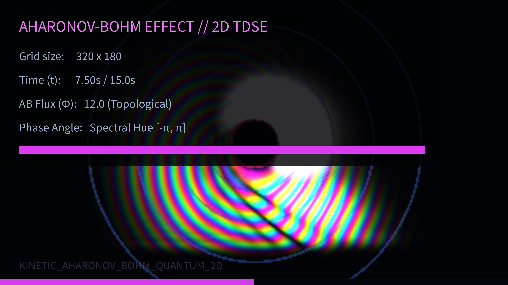

# kinetic_aharonov_bohm_quantum_2d

A 4K kinetic quantum mechanics simulation solving the 2D Time-Dependent Schrödinger Equation (TDSE) to visualize the Aharonov-Bohm effect, showcasing quantum phase shifts and topological wave scattering around a shielded magnetic flux tube.

## Concept

The Aharonov-Bohm effect is a fundamental quantum phenomenon illustrating that magnetic vector potential $\mathbf{A}$, rather than just the magnetic field $\mathbf{B}$, is physically observable. In this setup, a central cylinder shields a localized magnetic flux, meaning $\mathbf{B} = 0$ outside the cylinder, but $\mathbf{A} \neq 0$:

$$\mathbf{A} = \left( -\frac{\Phi}{2\pi} \frac{y}{x^2 + y^2}, \frac{\Phi}{2\pi} \frac{x}{x^2 + y^2} \right)$$

A Gaussian wave packet traveling from left to right meets the shielded cylinder and splits. Due to the non-zero vector potential, the wavefunction on the top experiences a different phase shift than the one on the bottom. When they reunite on the right side, they interfere, creating a shifted, asymmetrical interference pattern with vibrant rainbow-colored phase ripples.

## Technical Details

- **Quantum Engine**: Vectorized 2D Time-Dependent Schrödinger Equation (TDSE) solver using staggered leapfrog symplectic updates in NumPy.
- **Topological Coupling**: Direct coupling of vector potential $\mathbf{A}$ into gradient operators $\mathbf{A} \cdot \nabla \psi$.
- **Absorbing Boundaries**: Damping sponge boundary layers to absorb wave packets.
- **Visuals**: Wavefunction phase mapped directly to HSL spectral hues, probability density ($|\psi|^2$) mapped to brightness using gamma compression.
- **Output**: 900 frames compiled via FFmpeg into a 15-second 60fps video at 4K resolution.
