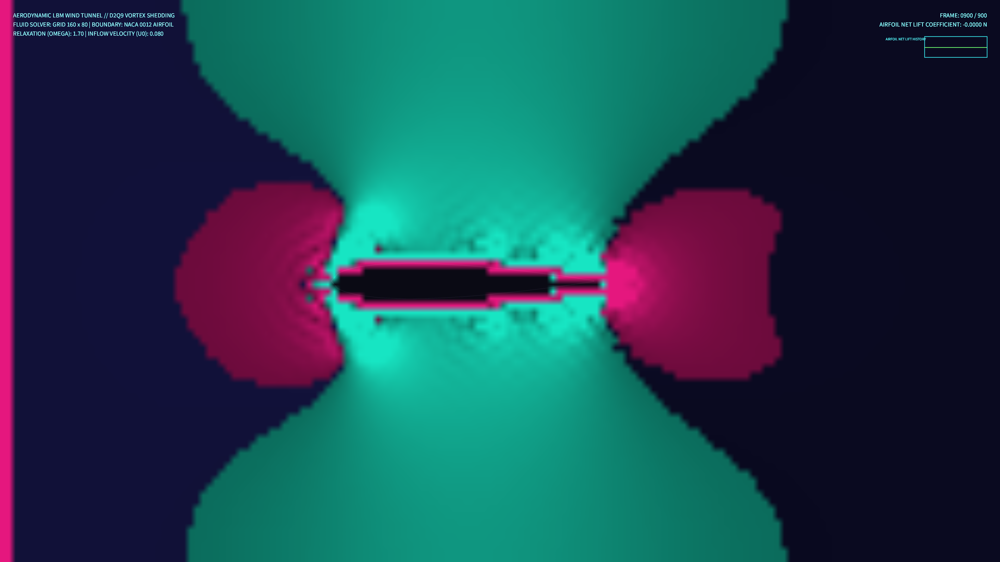

# kinetic_airfoil_vortex_lbm_2d

## Metadata
- **Date**: 2026-08-14
- **Theme**: An invisible wing slicing through a current of light, leaving behind a trail of swirling eddies and turbulent vortex spirals.
- **Technique**: 2D Lattice Boltzmann Method (LBM) D2Q9 fluid dynamics solver.
- **Logic Lab Reference**: None

## Concept
An aerodynamic fluid simulation modeling wake turbulence and boundary layer separation. The system solves the D2Q9 Lattice Boltzmann equations on a grid containing a solid NACA 0012 airfoil obstacle. Forced left-to-right velocity inflow streams past the wing, producing convective shear and shedding chains of counter-rotating Karman vortices downstream. The curl of the velocity field (vorticity) is computed and rendered dynamically as a glowing neon color field, mapping positive vorticity (counter-clockwise) to teal and negative vorticity (clockwise) to coral/pink.

## Technical Details
- **Renderer**: P2D
- **Simulation**: Vectorized D2Q9 LBM streaming and BGK collision steps in NumPy, coupled with boundary bounce-back conditions for NACA airfoil.
- **Visuals**: Vorticity-to-HSB color mapping, upscaled 4K interpolation, and additive neon airfoil border overlays.
- **Animation**: 15 seconds @ 60fps (900 frames total). Includes real-time Airfoil Net Lift Force telemetry HUD.
