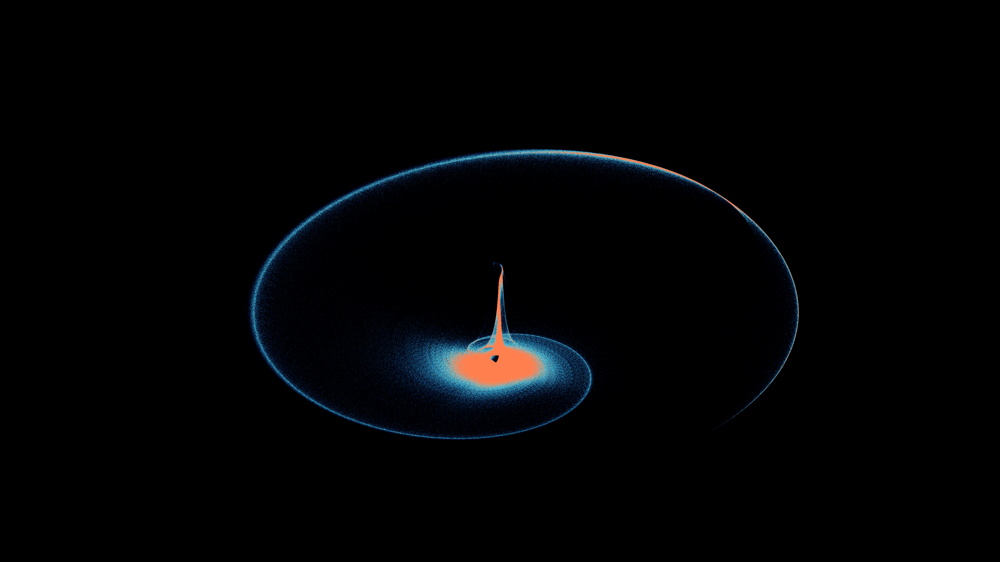

# kinetic_aizawa_attractor_2d

## Metadata
- **Date**: 2026-08-02
- **Theme**: A million-particle strange attractor collapsing into a cosmic singularity.
- **Technique**: GPU-scale particle simulation via vectorized NumPy, 2D density histogram rendering, motion-blur accumulation buffer.

## Concept
This work renders one million particles simultaneously flowing through the Aizawa strange attractor — a 3D chaotic system that resembles a distorted torus with a spiraling polar jet. Projected onto a 2D plane with continuous slow rotation, the attractor's high-density orbital ring and bright coronal core emerge organically from the collective motion of particles, evoking imagery of an accretion disk surrounding a black hole. The attractor parameter `a` is gently modulated over each 15-second loop, causing the morphology to breathe — tightening and relaxing the orbital structure in an endless chaotic dance.

## Technical Details
- **Renderer**: P2D (direct pixel manipulation via `np_pixels`)
- **Simulation**: 1,000,000 particles integrated with Euler's method (5 micro-steps per frame, dt=0.005) using fully vectorized NumPy operations.
- **Color Palette**: Three-zone density mapping — Navy Blue (sparse), Turquoise (mid-density), Coral (high-density cores).
- **Motion Blur**: Exponential decay accumulation buffer (`density_buffer * 0.85 + H`) creates smooth luminous trails without overdraw.
- **3D Projection**: Dual-axis rotation (Z-axis: continuous, X-axis: sinusoidal tilt) projects the 3D attractor onto the 2D canvas with time-varying perspective.
- **Animation**: 15 seconds (900 frames) @ 60 FPS.
