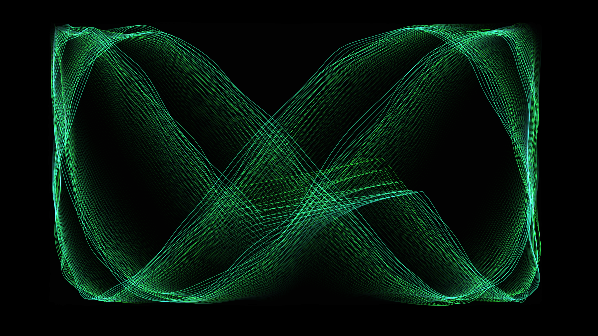

# kinetic_analog_oscilloscope_interference_2d

## Metadata
- **Date**: 2026-06-19
- **Theme**: The chaotic hum of a vintage oscilloscope rendering unstable high-frequency signals
- **Technique**: Procedurally generating Lissajous figures with continuously shifting phase and frequency ratios, using additive blending and a phosphor-decay motion blur to mimic an analog CRT screen.
- **Logic Lab Reference**: 

## Concept
The chaotic hum of a vintage oscilloscope rendering unstable high-frequency signals.

## Technical Details
- **Renderer**: Unknown
- **Simulation**: Unknown
- **Visuals**: Unknown
- **Animation**: Unknown
