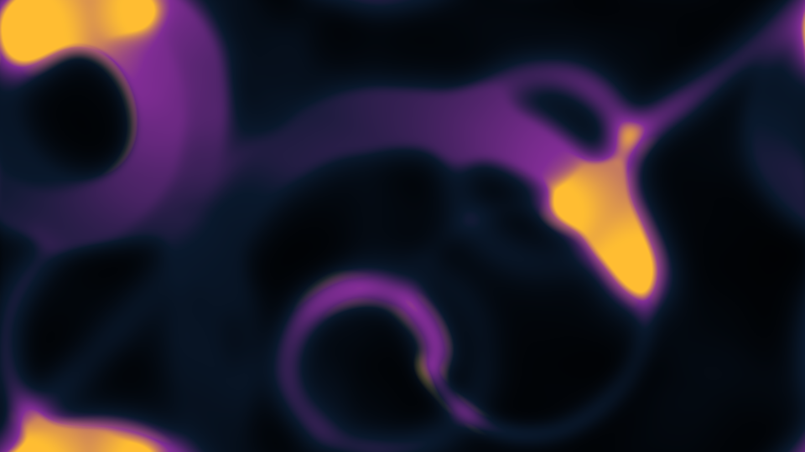

# kinetic_anisotropic_perona_malik_diffusion_2d

## Metadata
- **Date**: 2026-08-10
- **Theme**: Solidification of thoughts under pressure — fluid organic noise flows that slowly freeze and segment into sharp, crystalline cells.
- **Technique**: Vectorized 2D Perona-Malik Anisotropic Diffusion PDE solver with gradient-based edge-outline overlays, dynamic multi-agent attractor ink injection, and bilinear upscaling.

## Concept
This work explores the mathematical beauty of Perona-Malik Anisotropic Diffusion, a technique that reduces image noise while preserving and sharpening edges. The artwork simulates a process analogous to organic phase transitions, where a turbulent fluid of ideas or thoughts solidifies into a structured, crystalline mosaic. Eight orbiting attractors traverse the canvas, depositing glowing fields of intensity that blend with a background Perlin noise wind. As this intensity field undergoes anisotropic diffusion, the smoothing is suppressed near steep gradients, causing boundaries to crystallize into sharp, paint-like cells. A high-contrast golden highlight is mapped directly to the gradient magnitude, tracing the boundaries between deep Prussian blue and amethyst purple cells, resembling gold veins in cracked obsidian.

## Technical Details
- **Renderer**: P2D (bilinear upscaling from downscaled simulation grid to 4K output size).
- **Simulation**: Perona-Malik diffusion PDE solved on a `(540 × 960)` grid: $\frac{\partial I}{\partial t} = \nabla \cdot (c(\|\nabla I\|) \nabla I)$.
- **Diffusion Coefficient**: $c(\|\nabla I\|) = \frac{1}{1 + (\|\nabla I\| / K)^2}$ with $K = 0.08$ and time-step $dt = 0.15$.
- **Source Injection**: 8 moving particles (attractors) with toroidal wrapping deposit Gaussian-shaped intensity footprints, combined with a scrolling multi-octave sine/cosine-based noise field.
- **Edge Highlighting**: Central difference gradient magnitude $\nabla I = \sqrt{(\frac{\partial I}{\partial x})^2 + (\frac{\partial I}{\partial y})^2}$ computed using NumPy rolled arrays; gradients exceeding $0.02$ are colored with a molten gold glow.
- **Color Mapping**: Intensity range mapped to a three-tier gradient from black to deep Prussian blue, then to amethyst purple, and finally to golden white, fully vectorized in NumPy.
- **Animation**: 15 seconds (900 frames) @ 60 FPS.
