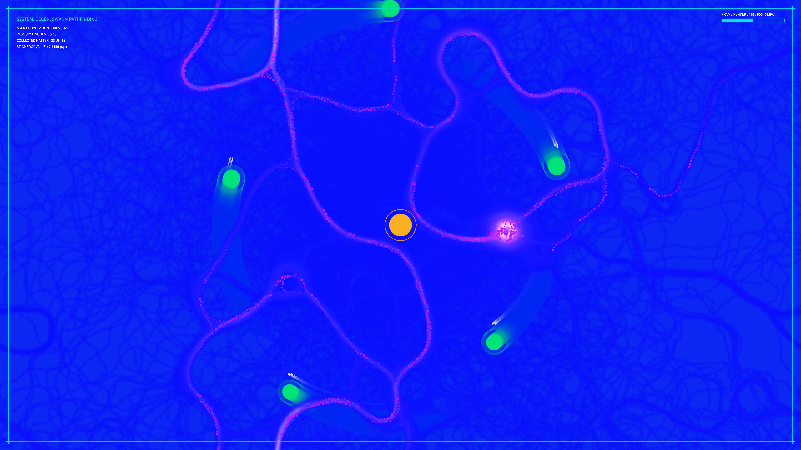

# kinetic_ant_stigmergy_optimization_2d

## Metadata
- **Date**: 2026-08-03
- **Theme**: Swarm intelligence, decentralized coordination, stigmergy, path optimization
- **Technique**: Vectorized 2D ant foraging simulation (800 agents), dual-layer home/food pheromone mapping, rolling shift neighborhood diffusion, offscreen buffer upscaling, and real-time laboratory HUD.
- **Logic Lab Reference**: [ant_colony_pheromone.py](file:///Users/asami/develop/art/logic-lab/src/logic_lab/swarm_intelligence/ant_colony_pheromone/ant_colony_pheromone.py)

## Concept
This artwork visualizes the emergent path optimization of a decentralized ant colony through stigmergy.
Eight hundred swarm agents (ants) navigate between a central nest and five orbital food resources. When empty, they deposit home pheromones and follow food pheromones. On picking up resources, they turn around, deposit food pheromones, and follow home pheromones back to the nest.
Over time, the shortest paths are reinforced, while longer paths evaporate. The food sources orbit the nest slowly, forcing the colony to continuously adapt its trails to the shifting layout.
The trails are rendered in a warm amber gold (home pheromone) and electric cyan (food pheromone) on a deep obsidian black background. The ants appear as glowing bioluminescent dots, shifting color from cyan (searching) to amber gold (carrying resource).
A technical HUD frame overlays the canvas, displaying parameters such as active population, collected units, resource nodes, and stigmergy values.

## Technical Details
- **Renderer**: Java2D
- **Simulation**: Vectorized NumPy arrays representing 800 agent states. Senses pheromone levels at left, center, right coordinates in parallel and computes turning angles. Pheromone evaporation and diffusion are implemented using vectorized array rolls.
- **Visuals**: Double-pass offscreen buffer blending, direct pixel channel mapping, and tech HUD frame.
- **Animation**: 15 seconds @ 60 FPS (900 frames)
