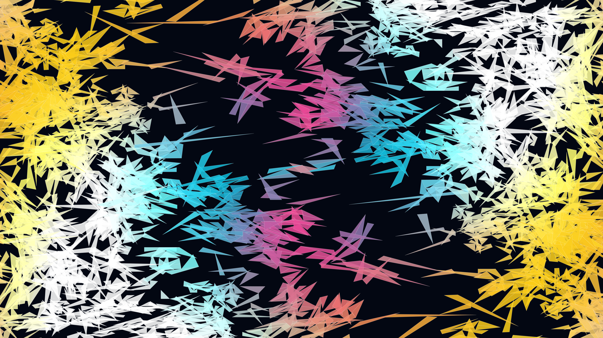

# kinetic_aperiodic_pinwheel_tiling_2d

A 4K generative media art animation exploring **Radin's Pinwheel Aperiodic Tiling** — a famous self-similar 2D fractal tiling composed of 1:2 right triangles ($1 : 2 : \sqrt{5}$) that continuously subdivides into 5 congruent sub-triangles.

## Concept

Unlike periodic grid tilings, the Pinwheel Tiling features infinitely many tile orientations that never repeat periodically. By recursively decomposing root right triangles into 5-fold sub-triangles across depth level 5, thousands of luminous stained-glass fragments are synthesized. A dual radial phase wave modulates tile colors (Neon Cyan `#06b6d4`, Electric Magenta `#ec4899`, Solar Gold `#facc15`, Deep Indigo `#4f46e5`) across spacetime, transforming strict mathematical subdivision into an evolving geometric kaleidoscope.

## Technical Details

- **Framework**: py5 (Processing for Python)
- **Math**: Exact Radin Pinwheel 5-fold recursive vector decomposition in normalized basis $(\mathbf{s}, \mathbf{v})$ where $\mathbf{v} = \mathbf{l}/2$
- **Resolution**: 3840×2160 (4K UHD), 60 FPS, 15-second seamless animation cycle (900 frames)
- **Rendering**: Custom polygon rendering with high-contrast obsidian void background (`#030712`) and crisp glowing tile borders
