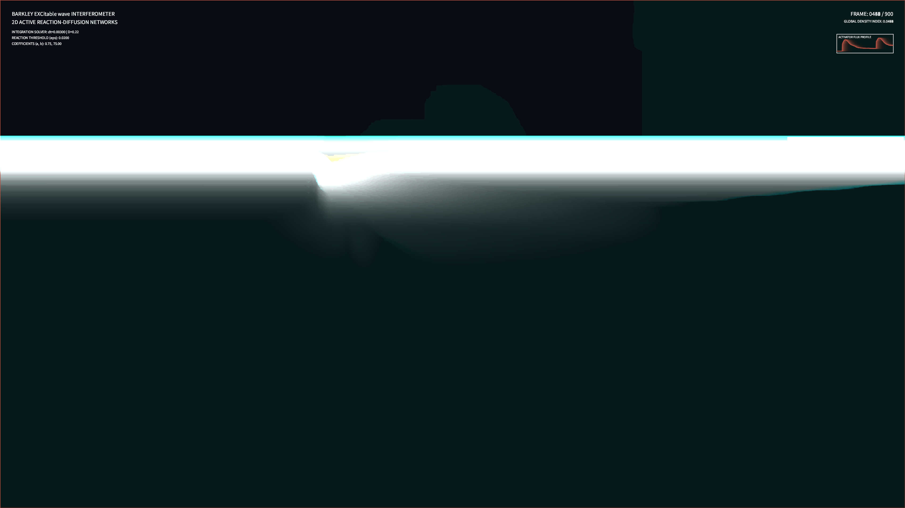

# kinetic_barkley_excitable_waves_2d

## Metadata
- **Date**: 2026-08-15
- **Theme**: Electric nerve impulses traveling through a living cybernetic mesh, twisting and curling into spirals under a chaotic wind.
- **Technique**: Vectorized 2D numerical integration of the Barkley model equations for excitable media coupled with coordinate advection driven by a Perlin noise flow field.
- **Logic Lab Reference**: None

## Concept
This work visualizes excitable media fronts using the Barkley model. In contrast to standard diffusion, waves here propagate with sharp fronts and slow refractory trails, generating complex spiral wave dynamics. Styled in cool cyans and emeralds with warm amber highlights, the pulses twist and flow dynamically under sub-pixel advection wind coordinates, creating a living cybernetic fabric.

## Technical Details
- **Renderer**: P2D
- **Simulation**: Barkley Activator-Inhibitor sub-stepping integration (8 steps/frame) and sub-pixel advection warping via OpenCV remapping.
- **Visuals**: HSB Color Mapping mapped to concentration layers, OpenCV contours, and fading trails.
- **Animation**: 15s @ 60fps (900 frames total)
