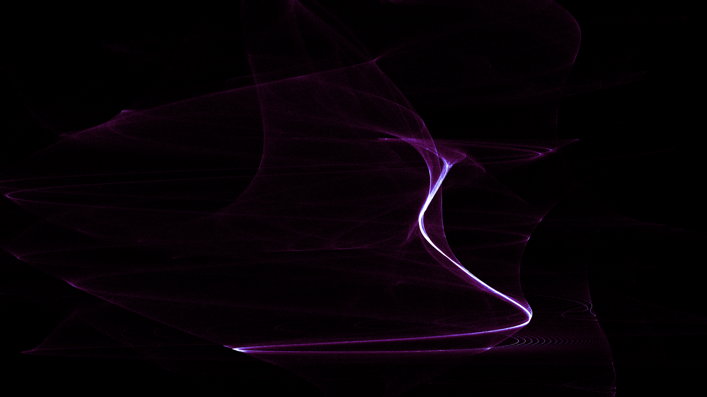

# kinetic_bedhead_attractor_2d

## Metadata
- **Date**: 2026-07-25
- **Theme**: A swirling vortex of threads resembling complex magnetic field lines or wild hair.
- **Technique**: Bedhead attractor map, 2D density histogram rendering, dual-parameter continuous modulation.

## Concept
This work visualizes 250,000 particles flowing through the Bedhead attractor — a 2D iterated map defined by trigonometric interactions between x and y coordinates. Unlike 3D strange attractors projected onto a plane, the Bedhead map is inherently two-dimensional, producing layered curtains of thread-like density that fold, twist, and cross each other in fluid waves. The visual reads like a time-lapse of magnetic field lines reorganizing, or the tangled structure of hair caught mid-motion in the dark. Both attractor parameters `a` and `b` are modulated sinusoidally over the 10-second loop, causing the threading structure to continuously writhe and transform its topology without ever repeating.

## Technical Details
- **Renderer**: P2D (direct pixel manipulation via `np_pixels`)
- **Simulation**: 250,000 particles iterated through the Bedhead map (`x_new = sin(xy/b)·y + cos(ax − y)`, `y_new = x + sin(y)/b`) using fully vectorized NumPy operations; 3 micro-steps per frame.
- **Color Palette**: Three-zone density mapping — Neon Magenta (sparse, base), Cyan (mid-density threads), Pure White (peak-density cores).
- **Motion Blur**: Exponential decay accumulation buffer (`density_buffer * 0.85 + H`) preserves luminous thread trails across frames.
- **Parameter Modulation**: `a = 0.6 + 0.3·sin(t)`, `b = 0.7 + 0.2·cos(1.5t)` — dual-frequency sinusoidal modulation drives continuous morphological change.
- **Animation**: 10 seconds (600 frames) @ 60 FPS.
