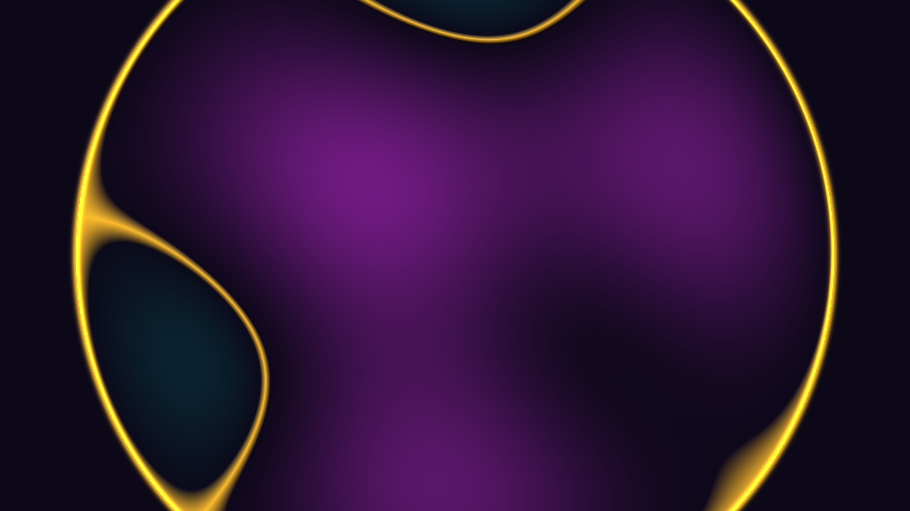

# kinetic_bessel_membrane_resonance_2d

A 4K kinetic visualization of circular membrane resonance, modeling the acoustic vibration of a clamped drumhead excited by multi-frequency stimulations.

## Concept

This piece models the physical displacement of a circular elastic membrane (like a drumhead) under multi-frequency acoustic excitation. The complex, breathing pattern is formed by the linear combination of multiple spatial vibration modes $(n, m)$, where each mode is defined by Bessel functions of the first kind $J_n(\lambda_{nm} r)$ combined with angular harmonics.

## Techniques

- **Bessel Modes Model**: Computes physical eigenvalues using `scipy.special.jn_zeros` to find the exact zero-crossings, ensuring the boundary of the membrane remains clamped ($u(R) = 0$).
- **Vectorized Displacement Grid**: Vectorized NumPy calculations of linear mode combinations across 8.3 million pixels per frame.
- **Nodal Line Glow**: Extracts and highlights lines of zero displacement (nodal lines) using a smooth density-clipping gradient mapping.
- **Direct Memory Blitting**: Fast blitting of generated ARGB NumPy arrays into `py5.np_pixels`.

## Palette

- **Background**: Deep Amethyst Void (dark indigo/purple-black)
- **Dominant**: Electric Cyan (glowing teal/cyan representing positive displacement)
- **Secondary**: Neon Amethyst (magenta/violet representing negative displacement)
- **Accent**: Solar Gold (golden yellow highlighting nodal lines and clamped border)
