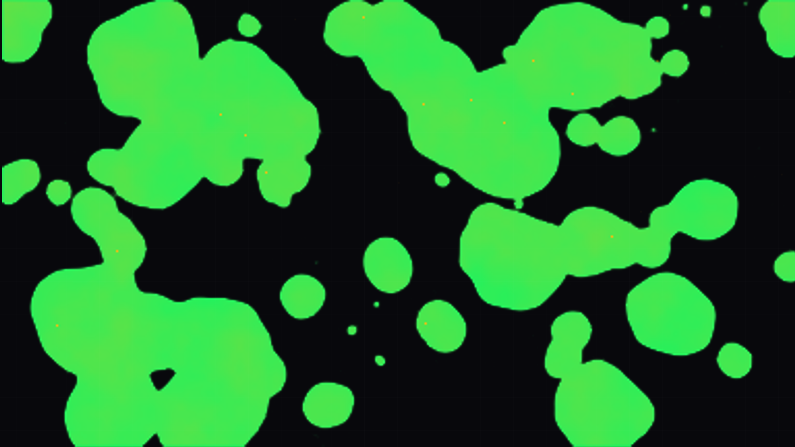

# kinetic_bioluminescent_moss_colony_2d

## Metadata
- **Date**: 2026-08-02
- **Theme**: Stochastic Biological Growth & Decay
- **Technique**: Vectorized 2D Stochastic Cellular Automata (CA) with bilinear texture upscaling
- **Logic Lab Reference**: [moss_colony_growth.py](file:///Users/asami/develop/art/logic-lab/src/logic_lab/cellular_automata/moss_colony_growth/moss_colony_growth.py)

## Concept
This piece visualizes the growth cycle of bioluminescent moss spreading across a damp, textured cybernetic substrate. Starting from 22 localized colonies, the moss organisms multiply stochastically, guided by a static 2D moisture-scale noise field. Spores seed new colonies randomly, producing brilliant golden-amber hotspots at active growth tips that bleed into neon emerald bodies. To simulate the organic, microscopic details of a live culture, a soft wind sways the entire organism, which eventually starves and decays back into the dark charcoal background. The work explores the boundary between digital geometry (indicated by a high-resolution cybernetic overlay grid) and organic, fluid self-organization.

## Technical Details
- **Renderer**: P2D
- **Simulation**: Vectorized 2D Stochastic CA update using shifted slices in NumPy, run offscreen on a 384x216 grid.
- **Visuals**: Bilinear texture upscaling to 4K (providing smooth, glowing organic anti-aliasing), a high-resolution screen-space grid mesh, and trigonometric wind sway.
- **Animation**: 15 seconds @ 60 FPS (900 frames)
