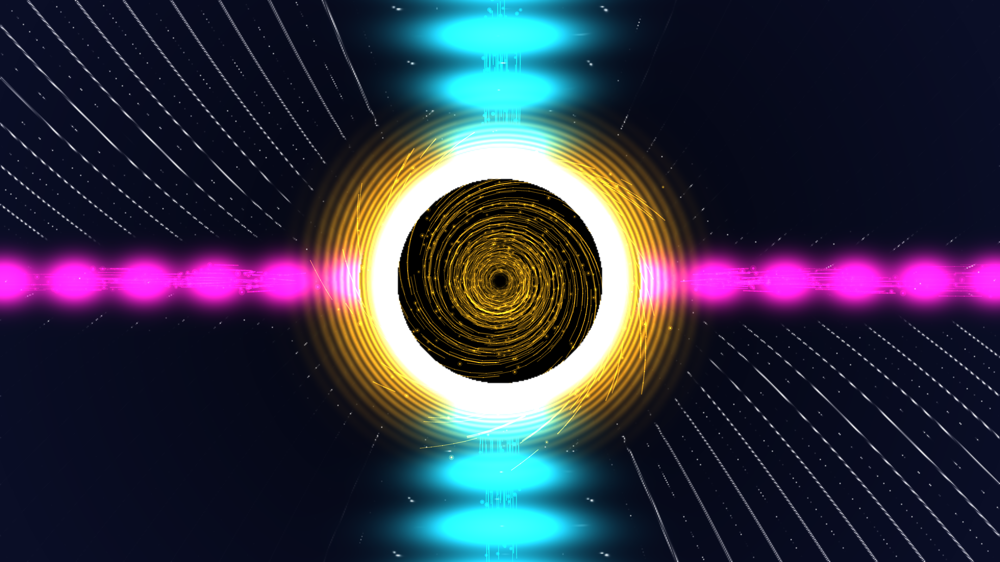

# kinetic_blandford_znajek_poynting_jet_2d

A 15-second kinetic media art visualization of general relativistic electrodynamics: the Blandford-Znajek process, spinning Kerr black hole magnetosphere ($a/M = 0.95$), Lense-Thirring ergosphere frame-dragging, parabolic magnetic flux surfaces, horizon rotational energy extraction, collimated relativistic Poynting jets, equatorial reconnection current sheet, and plasma chrome optics.

## Concept & Physics

In relativistic astrophysics, the **Blandford-Znajek (BZ) process** is the primary mechanism powering the most luminous particle accelerators in the universe—relativistic jets from supermassive black holes (such as M87*):

1. **Kerr Spacetime & Frame Dragging ($a/M = 0.95$)**:
   The black hole event horizon is situated at $r_+ = M + \sqrt{M^2 - a^2}$. Surrounding the horizon is the oblate **ergosphere** ($r_{ergo}(\theta) = M + \sqrt{M^2 - a^2 \cos^2\theta}$), where spacetime itself is dragged into rapid azimuthal rotation at angular velocity $\omega(r, \theta)$.

2. **Force-Free Magnetosphere & Induction**:
   Magnetic field lines threading the horizon are forced to rotate at angular frequency $\Omega_F \approx \frac{1}{2} \Omega_H$. This rotation induces an immense toroidal electric field $\vec{E} = -\vec{v}_F \times \vec{B}$ that accelerates electron-positron pairs.

3. **Rotational Energy Extraction via Poynting Flux**:
   The cross-product of induced electric and toroidal magnetic fields generates a collimated, ultra-relativistic outward Poynting flux:
   $$S^r = \frac{1}{4\pi} \sqrt{-g} E_\theta B^\phi \propto \Omega_F (\Omega_H - \Omega_F) B_n^2 \sin^2\theta$$
   This extracts rotational energy directly from the spinning black hole, launching twin collimated Poynting jets along the north and south rotational poles ($v \approx 0.99c$).

4. **Equatorial Reconnection Current Sheet**:
   Opposite magnetic polarities meet in the equatorial plane, forming a dynamic Parker-Sweet current sheet where magnetic reconnection injects energetic pair plasma and synchrotron leptons into the jet funnel.

## Visual Dynamics

- **Event Horizon & Photon Ring**: Central pitch-black gravitational shadow framed by a searing diamond-white photon ring flare.
- **Ergosphere Frame Dragging**: Swirling vortex of incandescent solar amber and molten gold Lense-Thirring flux.
- **Relativistic Poynting Jets**: Twin vertical collimated funnels blazing with coherent electric cyan and glacial white wavepackets.
- **Equatorial Current Sheet**: Glowing actinic amethyst and laser magenta magnetic reconnection layer with plasmoid bursts.
- **Lagrangian Synchrotron Leptons**: Relativistic electron-positron pairs accelerated along the polar jets and spiraling through the ergosphere.

## Color Palette

- **Poynting Jet Core & Photon Ring** (`#00f0ff`, `#ffffff`): Electric glacial cyan and blinding diamond white (40%).
- **Ergosphere Frame Dragging & Helices** (`#ffb703`, `#ff7b00`): Incandescent solar amber and molten gold (35%).
- **Equatorial Reconnection Sheet & Plasmoids** (`#9d4edd`, `#ff007f`): Actinic amethyst and laser magenta (15%).
- **Kerr Spacetime Vacuum Void** (`#02040a`, `#080d1e`): Deep obsidian indigo void (background, 10%).

## Technical Implementation

- **Platform**: py5 (Python Processing architecture)
- **General Relativistic Electrodynamics**: Exact Kerr horizon/ergosphere metric boundaries, Blandford-Znajek parabolic magnetic flux streamfunctions $\Psi(r, \theta)$, and collimated Poynting flux distributions.
- **Surface Optics**: Composite optical relief gradient surface normals $\vec{N} = (-\nabla H, 1.0)$ with dual-light Blinn-Phong specular plasma chrome shading.
- **Particle System**: Lagrangian relativistic synchrotron leptons and reconnection plasmoids with additive blending (`ADD`).
- **Output**: 1920×1080 @ 60fps (900 frames, 15 seconds), H.264 video.
