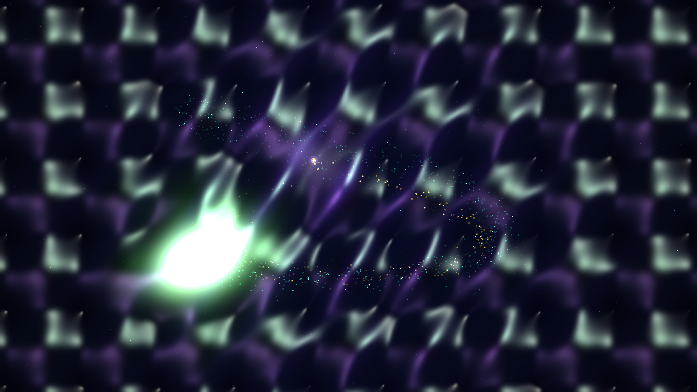

# kinetic_bloch_oscillations_zener_tunneling_2d

2D quantum mechanical simulation of **Bloch Oscillations** and **Landau-Zener Inter-Band Tunneling** in a periodic optical crystal lattice.

## Concept

In quantum solid-state physics, when a charged or neutral particle in a periodic crystal lattice (or ultracold atoms in an optical lattice) is subjected to a constant external force, it does not accelerate indefinitely. Instead, as its crystal momentum sweeps across the Brillouin zone, Bragg reflection at the zone boundaries forces the wavepacket into periodic harmonic back-and-forth motion known as **Bloch Oscillations**.

When the external force is sufficiently strong, the wavepacket approaches the avoided crossing at the Brillouin zone edge and undergoes non-adiabatic **Landau-Zener Tunneling**, bifurcating across the forbidden energy bandgap into a higher band and generating a multi-tiered **Wannier-Stark ladder** resonance.

This piece simulates:
- **Harmonic Bloch Oscillations**: Lissajous orbital motion of the primary quantum wavepacket across a 2D periodic egg-crate potential $V_{\text{lat}}(x, y)$.
- **Landau-Zener Band Tunneling**: Coherent daughter wavepacket creation and golden tunneling spark bursts at maximum momentum turning points.
- **Wannier-Stark Ladder States**: Equispaced diagonal resonance fringes formed by the tilted potential landscape.
- **3D Blinn-Phong Specular Quantum Potential Shading**: Normal vectors computed from the composite potential surface reflecting dual cool-mint and radiant amethyst light sources.
- **Lagrangian Quantum Tracers**: Bohmian probability current particles swirling in the wavepacket core, Zener tunneling sparks bridging bands, and localized lattice-well embers.

## Specifications

- **Format**: 4K 60fps Animation (900 frames, 15 seconds)
- **Palette**:
  - Background (60%): Quantum Lattice Obsidian Void & Deep Sub-Band Indigo (`#02030a`, `#070a1a`)
  - Dominant (60% of foreground): Luminous Emerald & Mint Wavefronts (`#10b981`, `#34d399`, `#059669`)
  - Secondary (30% of foreground): Deep Amethyst & Radiant Violet Inter-Band Glow (`#8b5cf6`, `#7c3aed`)
  - Accent (10% of foreground): Incandescent Zener Tunneling Spark Diamond-White & Solar Gold (`#ffffff`, `#facc15`)
- **Resolution**: 3840×2160 (Output) / 1920×1080 (Preview)
