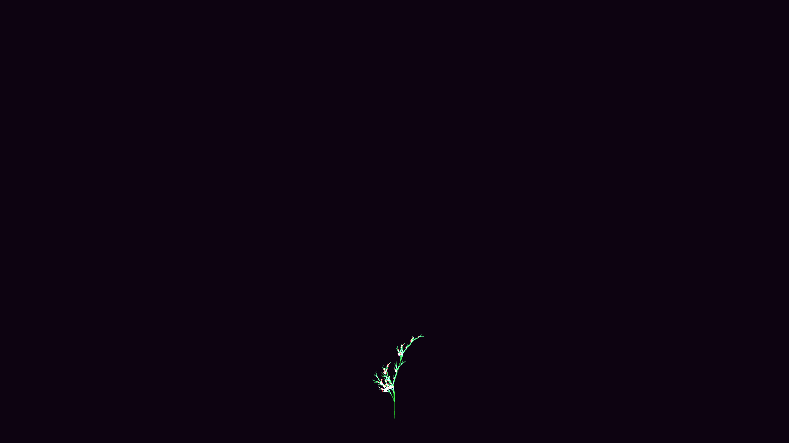

# kinetic_botanical_l_system_2d

## Metadata
- **Date**: 2026-08-02
- **Theme**: Lindenmayer branching geometry, organic plant dynamics, wind flow fields
- **Technique**: L-System sentence expansion, progressive growth fraction scaling, Perlin noise wind sway propagation, HSB gradient color mapping.
- **Logic Lab Reference**: [botanical_l_system.py](file:///Users/asami/develop/art/logic-lab/src/logic_lab/fractals/botanical_l_system/botanical_l_system.py)

## Concept
This piece simulates the life cycle and movement of a bioluminescent fern canopy. The branching structure is procedurally generated using Lindenmayer System (L-System) rules.
As the animation begins, the plant sprouts and expands progressively over the first 11 seconds. Once fully grown, the entire structure sways under a dynamic wind field driven by 2D Perlin noise. The segment rotation offsets propagate down the branch hierarchy, causing the outer leaves and glowing pink/gold flowers at the tips to sway with realistic, fluid inertia. The stems shift from dark forest emerald near the trunk to neon mint at the twigs, glowing against a deep amethyst background.

## Technical Details
- **Renderer**: Java2D
- **Simulation**: 5 generations of the "fern canopy" production rules (`F-[[X]+X]+F[+FX]-X`, `F=FF`) resulting in a 19,000 symbol sentence. 
- **Growth**: progressive translation of the parsed sentence from 0% to 100% over 660 frames.
- **Animation**: 15 seconds @ 60 FPS (900 frames)
