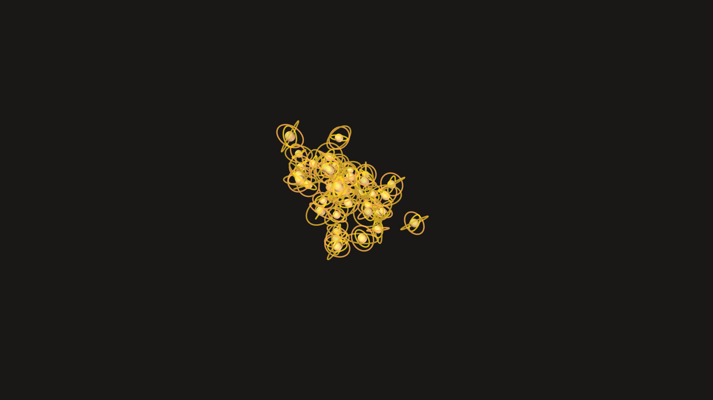

# kinetic_brass_gyroscope_swarm_3d

## Metadata
- **Date**: 2026-06-05
- **Theme**: Generative Art
- **Technique**: 3D rotational matrices, nested Push/Pop. Swarm positions are placed with 3D noise.  
- **Logic Lab Reference**: 

## Concept
No concept description provided.

## Technical Details
- **Renderer**: Unknown
- **Simulation**: Unknown
- **Visuals**: Unknown
- **Animation**: Contains animation details
