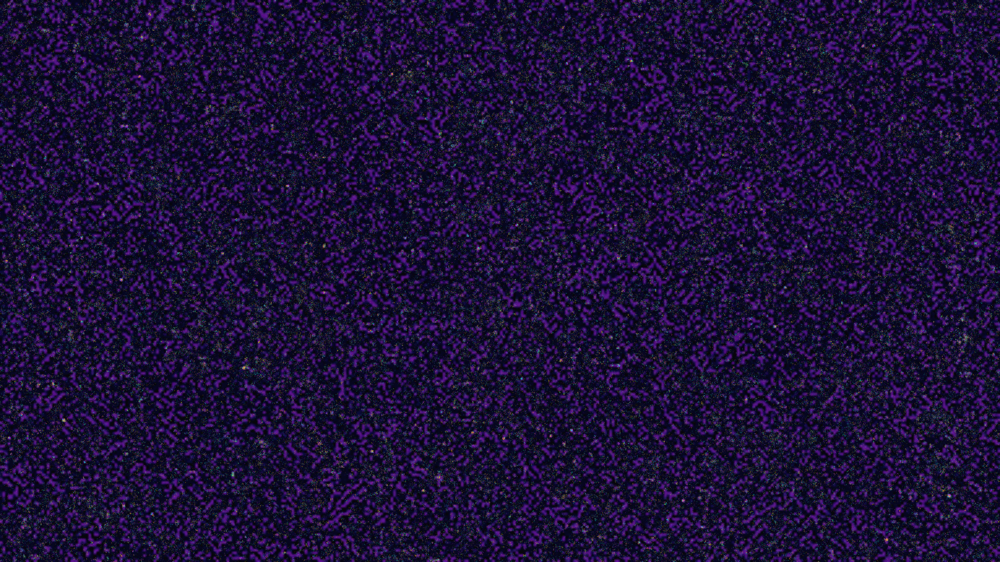

# kinetic_brusselator_reaction_diffusion_2d

A 4K generative media art animation visualizing the dynamic self-organization of the **Brusselator reaction-diffusion model** coupled with divergence-free tracer particle flow.

## Concept

The Brusselator is a classical theoretical model of an autocatalytic chemical reaction. We simulate the coupled nonlinear partial differential equations (PDEs) on a 2D grid:
$$
\frac{\partial u}{\partial t} = D_u \nabla^2 u + a - (b + 1)u + u^2 v
$$
$$
\frac{\partial v}{\partial t} = D_v \nabla^2 v + bu - u^2 v
$$
Using parameter values in the excitable limit-cycle regime, the chemical system generates a complex, homogeneous labyrinth of rotating spiral waves.

We construct a divergence-free (curl) velocity field from the concentration gradient of the activator field $u$:
$$
\mathbf{v}_{\text{flow}} = \left( \frac{\partial u}{\partial y}, -\frac{\partial u}{\partial x} \right)
$$
40,000 tracer particles are advected along the contour lines of the chemical fronts, creating glowing filaments of Luminous Teal, Electric Lavender, and Solar Gold that trace out the organic chemical wave fronts.

## Technical Details

- **Framework**: py5 (Processing for Python) + NumPy
- **Math**: Finite Difference Method (FDM) explicit Euler integration for coupled reaction-diffusion equations. Periodic boundary conditions using vectorized NumPy rolls.
- **Rendering**: 4K UHD (3840×2160), 60 FPS, 15-second loop (900 frames). Low-resolution grid upscaled via native bilinear GPU filtering combined with accumulation trails.
