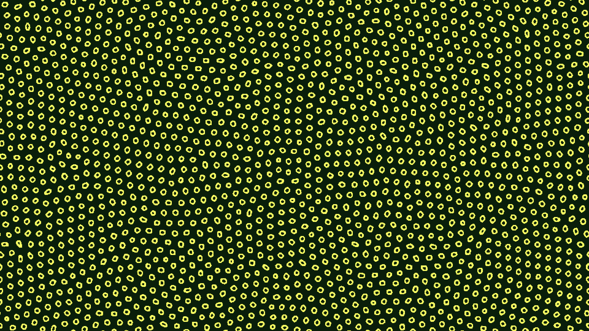

# kinetic_cellular_automata_lenia_2d

## Metadata
- **Date**: 2026-07-01
- **Theme**: A continuous cellular automata simulation based on the Lenia framework, manifesting complex, organic
- **Technique**: Unknown
- **Logic Lab Reference**: 

## Concept
A continuous cellular automata simulation based on the Lenia framework, manifesting complex, organic, alien-like lifeforms.

## Technical Details
- **Renderer**: Unknown
- **Simulation**: Unknown
- **Visuals**: Unknown
- **Animation**: Contains animation details
