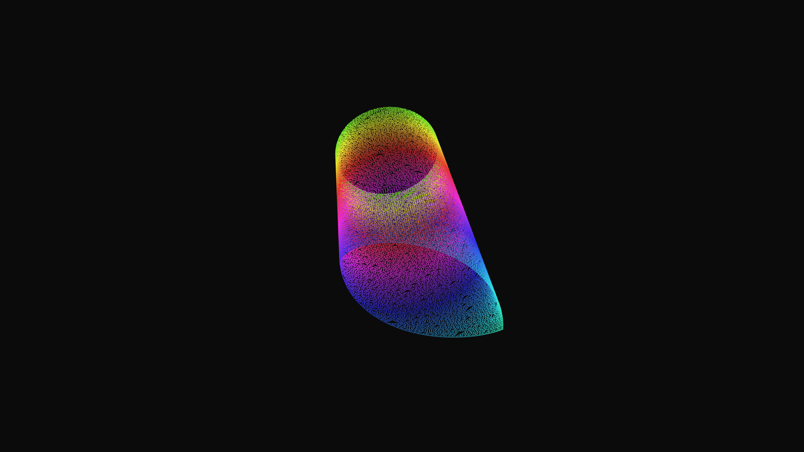

# kinetic_cellular_automata_woven_2d

## Metadata
- **Date**: 2026-06-20
- **Theme**: A 1D cellular automata woven into a cylindrical 3D rug structure
- **Technique**: Unknown
- **Logic Lab Reference**: 

## Concept
A 1D cellular automata woven into a cylindrical 3D rug structure.

## Technical Details
- **Renderer**: Unknown
- **Simulation**: Unknown
- **Visuals**: Unknown
- **Animation**: Contains animation details
