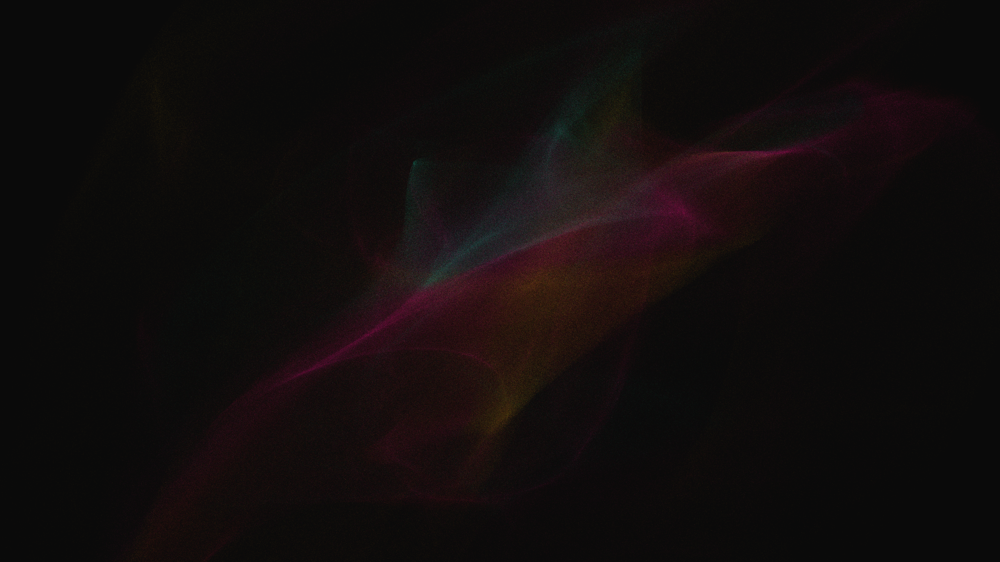

# kinetic_chaotic_attractor_volumetric_cloud_3d

## Metadata
- **Date**: 2026-07-01
- **Theme**: A generative visualization of a custom 3D discrete chaotic attractor, forming an intricate, morphing
- **Technique**: Unknown
- **Logic Lab Reference**: 

## Concept
A generative visualization of a custom 3D discrete chaotic attractor, forming an intricate, morphing volumetric cloud of mathematical smoke.

## Technical Details
- **Renderer**: Unknown
- **Simulation**: Unknown
- **Visuals**: Unknown
- **Animation**: Contains animation details
