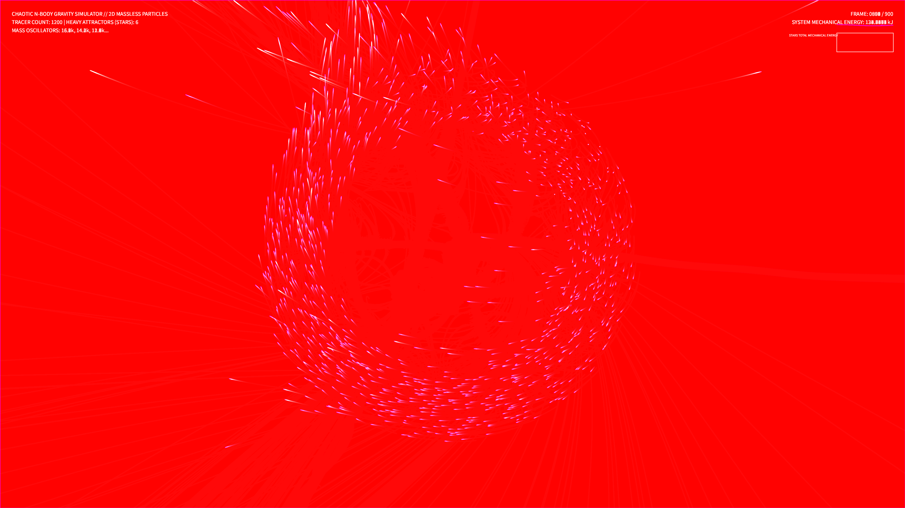

# kinetic_chaotic_n_body_ribbons_2d

## Metadata
- **Date**: 2026-08-14
- **Theme**: Faint trails of cosmic dust caught in the shifting gravity wells of multiple unseen stars, drawing complex orbital webs that stretch and break.
- **Technique**: Time-varying N-body gravitational simulation.
- **Logic Lab Reference**: None

## Concept
A computational gravity simulation demonstrating orbital chaos. The system models 6 primary stars moving dynamically, with their mass values modulated by slow sine-wave LFOs to create continuously shifting gravity fields. These shifting attractors deform the orbits of 1,200 passive, massless test particles seeded in a ring. The particles trace glowing orbital ribbons in a bioluminescent color palette of mint green, electric indigo, and solar amber gold, with their speeds mapped to hue shifts.

## Technical Details
- **Renderer**: P2D
- **Simulation**: Vectorized Newtonian gravity solver for stars and test particles in NumPy, including mass oscillations and softening factors.
- **Visuals**: Speed-based HSB color shifting, additive blending (`py5.ADD`), and low-alpha trails for long-exposure orbital paths.
- **Animation**: 15 seconds @ 60fps (900 frames total). Includes real-time Star Total Mechanical Energy telemetry HUD.
