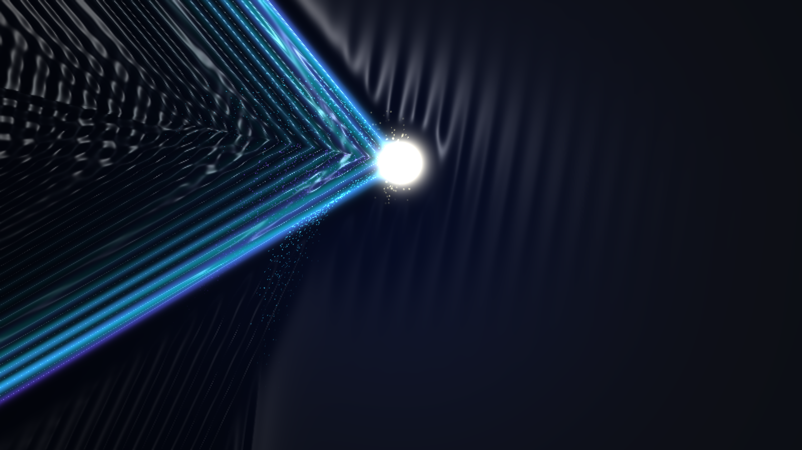

# kinetic_cherenkov_radiation_shock_front_2d

2D electrodynamic and relativistic quantum simulation of **Cherenkov Radiation** and superluminal shock wavefronts in a dielectric medium.

## Concept

When a high-energy relativistic charged particle traverses a dielectric medium (such as water) at a velocity $v$ exceeding the local phase velocity of light ($v > c/n$), it ruptures the optical barrier, emitting an electromagnetic shock wave cone known as **Cherenkov Radiation**—the iconic, eerie electric blue glow observed in nuclear reactor cooling pools.

This piece simulates:
- **Huygens Shock Cone Envelope**: Coherent constructive interference forming an asymmetric Mach shock cone governed by the Cherenkov relation $\cos(\theta_c) = \frac{1}{\beta n}$.
- **Frank-Tamm Chromatic Dispersion**: Frequency-dependent refractive index dispersion ($n_{\text{UV}} > n_{\text{blue}}$) causing the shock front to split into chromatic fringe layers spanning deep actinic violet to electric cyan.
- **Secondary Bremsstrahlung & Delta-Ray Cascade**: Deceleration nodes shedding daughter shock cones and secondary electron branch sparks.
- **3D Blinn-Phong Specular Caustic Shading**: Surface normal field derived from optical energy density $\nabla H(x, y)$ reflecting dual light sources as liquid chromium caustic ripples.
- **Lagrangian Scintillation Kinematics**: Additive glow particles launched along the shock wave front, ionization embers drifting in the thermal wake, and secondary cascade sparks.

## Specifications

- **Format**: 4K 60fps Animation (900 frames, 15 seconds)
- **Palette**:
  - Background (60%): Reactor Pool Obsidian Void & Midnight Indigo Abyss (`#02040a`, `#070e24`)
  - Dominant (60% of foreground): Cherenkov Shock Wavefronts, Electric Cyan & Glacial Azure (`#06b6d4`, `#38bdf8`)
  - Secondary (30% of foreground): Deep Violet & Actinic Ultraviolet Fluorescent Glow (`#4f46e5`, `#7c3aed`)
  - Accent (10% of foreground): Incandescent Lepton Core Diamond-White & Bremsstrahlung Gold Caustics (`#ffffff`, `#fef08a`)
- **Resolution**: 3840×2160 (Output) / 1920×1080 (Preview)
