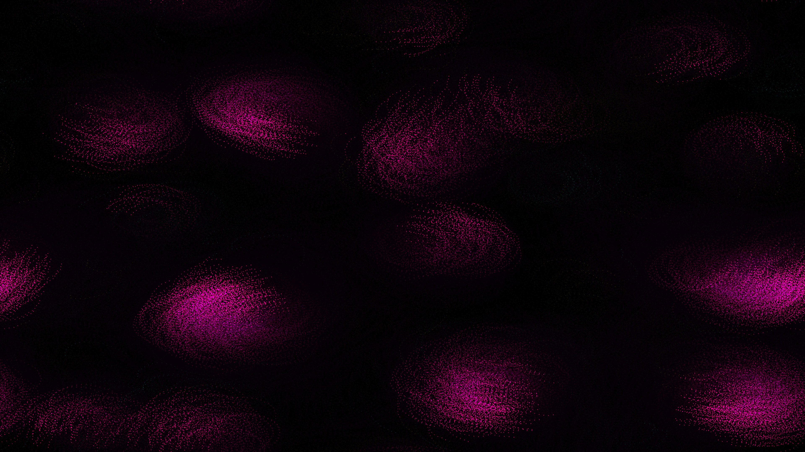

# kinetic_chiral_active_matter_2d

## Metadata
- **Date**: 2026-08-17
- **Theme**: A self-propelled particle swarm exhibiting coherent vortical phase motion and collective flocking under chiral torque.
- **Technique**: Vectorized Chiral Vicsek model active matter simulation in NumPy with periodic wrapping, multi-phase density coloring, and additive motion trails.

## Concept
This artwork explores non-equilibrium active systems where individual agents (self-propelled particles) possess an intrinsic rotation (chirality) in addition to alignment tendencies. Half of the swarm spins clockwise (rendered in glowing amber), while the other half spins counter-clockwise (rendered in neon teal). As they interact, they segregate into synchronized orbital domains. When the local density exceeds a critical threshold, the agents form high-speed spinning mills that glow in electric pink.

## Technical Details
- **Renderer**: Py5 default
- **Simulation**: Vectorized Chiral Vicsek Model in NumPy with toroidal wrapping.
- **Visuals**: Density-dependent color classification, and additive rendering overlayed with alpha decay trails.
- **Animation**: 15s @ 60fps
