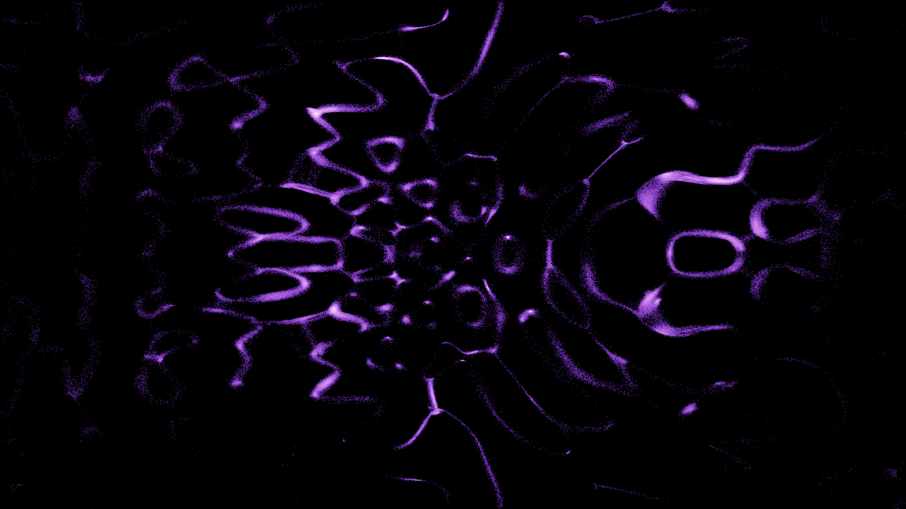

# kinetic_chladni_hyperdimensional_resonance_2d

A 4K generative media art animation visualizing **Hyperdimensional Chladni Resonance Patterns** — complex, self-organizing standing wave geometries formed on a vibrating hyper-plate.

## Concept

Chladni patterns are acoustic standing wave nodes where grains of sand naturally gather because those points do not vibrate. In this artwork, we simulate a 4D vibrating hyper-plate. The 4D space coordinates $(x,y,z,w)$ of 300,000 active cosmic dust grains are continuously rotated in 4D space across two planes ($xz$ and $yw$), and their 4D standing wave amplitudes are projected back to the 2D screen. Grains dynamically migrate toward shifting nodal regions, forming liquid sacred geometry.

## Technical Details

- **Framework**: py5 (Processing for Python) + NumPy
- **Math**: 4D spatial coordinate embedding, dual-plane 4D rotation matrices, and analytical finite-difference gradients of the 4D standing wave amplitude field
- **Physics**: Particle advection with capped velocity magnitudes to prevent numeric scattering, coupled with Gaussian-like box blur shaders to create glowing filaments
- **Resolution**: 3840×2160 (4K UHD), 60 FPS, 15-second seamless loop (900 frames)
- **Palette**: Cosmic Neon (Deep Indigo, Sapphire Blue, Neon Purple, Hot Pink, Pure White) on an Obsidian Void background
