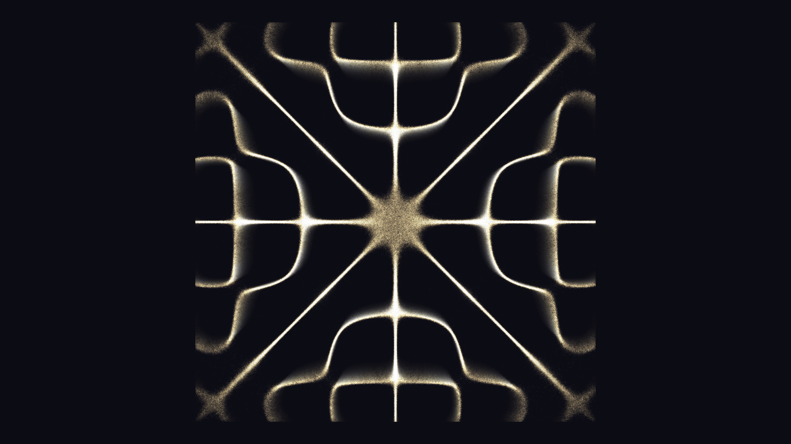

# kinetic_chladni_plate_cymatics_2d

## Metadata
- **Date**: 2026-07-01
- **Theme**: An autonomous generative physics simulation of Cymatics, visualizing the complex standing wave patte
- **Technique**: Unknown
- **Logic Lab Reference**: 

## Concept
An autonomous generative physics simulation of Cymatics, visualizing the complex standing wave patterns (Chladni figures) formed on a vibrating metal plate.

## Technical Details
- **Renderer**: Unknown
- **Simulation**: Unknown
- **Visuals**: Unknown
- **Animation**: Contains animation details
