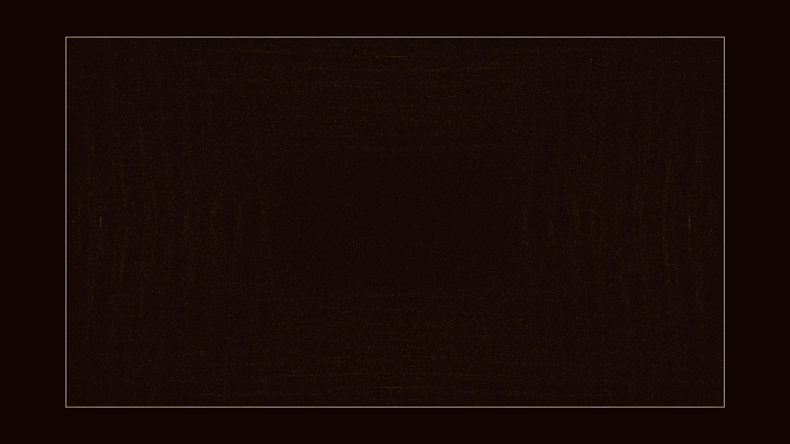

# kinetic_chladni_plate_resonance_2d

## Metadata
- **Date**: 2026-06-26
- **Theme**: Generative Art
- **Technique**: 2D particle system physics simulation. A mathematical standing wave equation determines the nodal lines across the surface. Particles are pushed down the gradient of the amplitude towards the nodes, while experiencing random jitter in high-amplitude areas. Rendered using a trailing motion-blur effect in Java2D.
- **Logic Lab Reference**: 

## Concept
No concept description provided.

## Technical Details
- **Renderer**: Unknown
- **Simulation**: Unknown
- **Visuals**: Unknown
- **Animation**: Unknown
