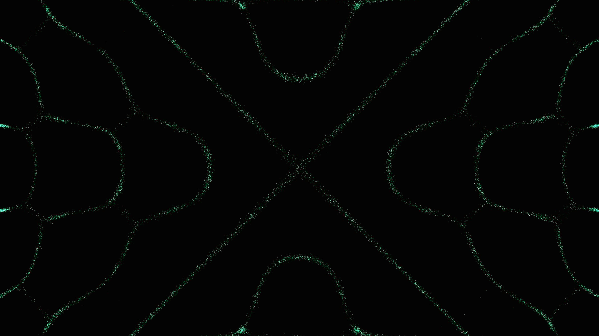

# kinetic_chladni_resonance_patterns_2d

A simulation of Chladni resonance patterns where particles collect on nodal lines of a vibrating plate.

## Details
- **Date**: 2026-06-20
- **Technique**: Thousands of particles whose velocities are influenced by gradients of a 2D Chladni standing wave equation.
- **Format**: Animation (10s @ 60fps)
