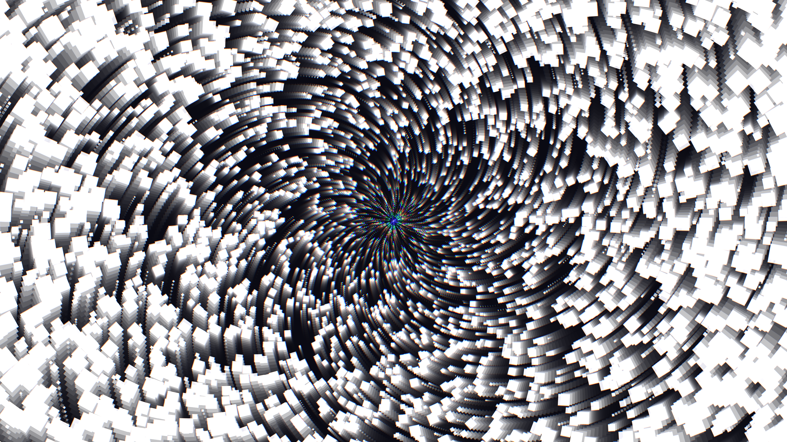

# kinetic_chromatic_aberration_vortex_2d

## Metadata
- **Date**: 2026-07-01
- **Theme**: An abstract procedural animation depicting a swirling vortex of geometric shapes getting pulled into
- **Technique**: Unknown
- **Logic Lab Reference**: 

## Concept
An abstract procedural animation depicting a swirling vortex of geometric shapes getting pulled into a massive gravitational singularity. As the entities spiral inward toward the center, intense chromatic aberration causes their RGB light waves to separate and distort, producing intense glowing trails and color-banding before they cross the event horizon.

## Technical Details
- **Renderer**: Unknown
- **Simulation**: Unknown
- **Visuals**: Unknown
- **Animation**: Contains animation details
