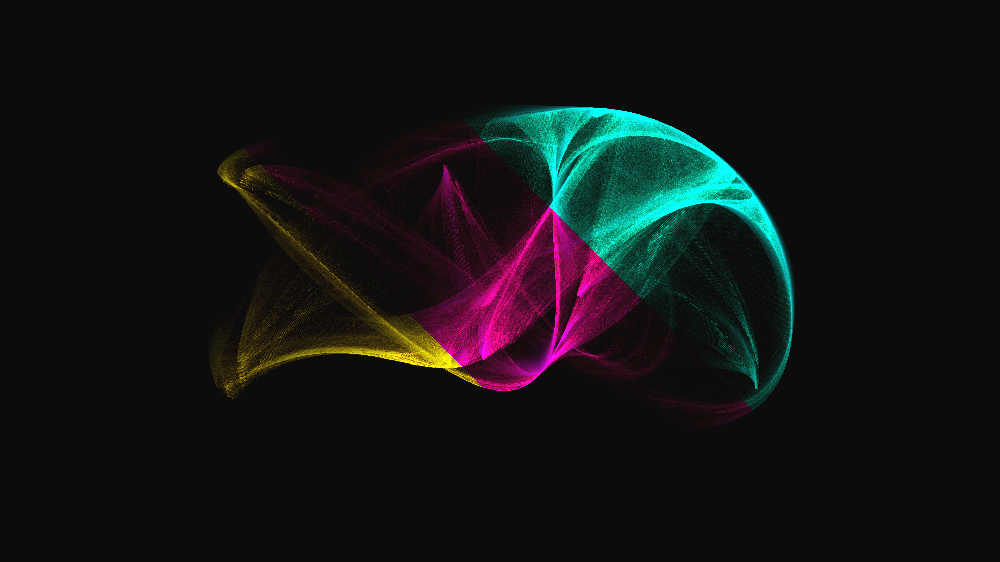

# kinetic_clifford_attractor_morph_2d

## Metadata
- **Date**: 2026-07-01
- **Theme**: An animated generative sequence exploring the Clifford Attractor, a discrete 2D chaotic map known fo
- **Technique**: Unknown
- **Logic Lab Reference**: 

## Concept
An animated generative sequence exploring the Clifford Attractor, a discrete 2D chaotic map known for producing beautifully intricate, smoky, and veil-like interference patterns.

## Technical Details
- **Renderer**: Unknown
- **Simulation**: Unknown
- **Visuals**: Unknown
- **Animation**: Contains animation details
