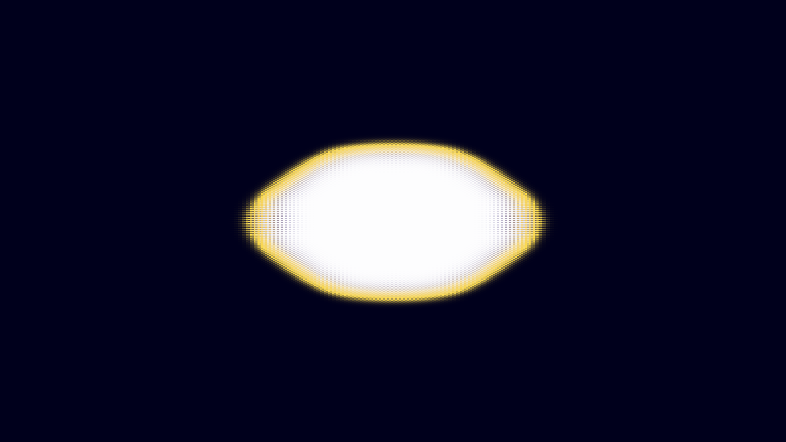

# kinetic_crystal_solidification_dendrite_2d

## Metadata
- **Date**: 2026-08-02
- **Theme**: Dendritic crystal growth and phase transitions in undercooled liquid.
- **Technique**: Karma-Rappel Phase-Field PDE solver, 6-fold hexagonal anisotropy, central finite difference Laplacian/gradient flux solver, direct ARGB NumPy pixel mapping.
- **Logic Lab Reference**: `crystal_growth/crystal_solidification/crystal_solidification.py`

## Concept
This sketch simulates the physical process of crystallization in an undercooled melt using a phase-field PDE model. A continuous order parameter tracks the phase transition (liquid $\phi=0$, solid $\phi=1$) while local latent heat release is tracked by the dimensionless temperature field $u$. Governed by 6-fold hexagonal anisotropy, the crystal seeds at the center and unfolds into a massive, intricate dendritic snowflake structure. Visually, it is designed with a striking "fire-ice" bioluminescent aesthetic: the frozen core is a clean, pearlescent ice-blue/white; the active solid-liquid interface glows with brilliant neon amber gold as it releases latent heat energy; and the surrounding liquid field is a deep, translucent cobalt blue that warms to a violet twilight near the growth boundary.

## Technical Details
- **Renderer**: P2D / direct pixel buffer injection.
- **Simulation**: Phase-field PDE solved on a 400×400 grid with periodic boundaries (3 steps per frame), upscaled dynamically to 4K.
- **Visuals**: Vectorized NumPy pixel color blending combining solid fraction $\phi$, local temperature $u$, and interface gradient magnitude.
- **Animation**: 15 seconds (900 frames) @ 60 FPS.
