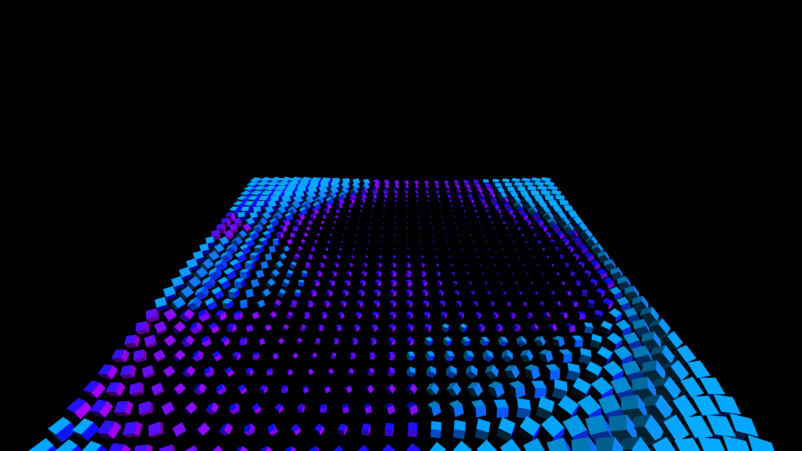

# kinetic_cube_matrix_wave

## Metadata
- **Date**: 2026-05-27
- **Theme**: - **Date**: 2026-05-27 - **Theme**: An isometric view of a massive field of 3D cubes
- **Technique**: Unknown
- **Logic Lab Reference**: 

## Concept
- **Date**: 2026-05-27
- **Theme**: An isometric view of a massive field of 3D cubes. The cubes constantly rotate and scale, driven by an invisible complex wave function, looking like a kinetic sculpture.
- **Technique**: A 2D nested loop creating instances of py5.box(). The scale, rotation, and color of each box are determined by its (x,y) index, passed through Perlin noise and sine functions mapped over time.
- **Description**: An animated 3D kinetic cube matrix wave.

## Technical Details
- **Renderer**: Unknown
- **Simulation**: Unknown
- **Visuals**: Unknown
- **Animation**: Unknown
