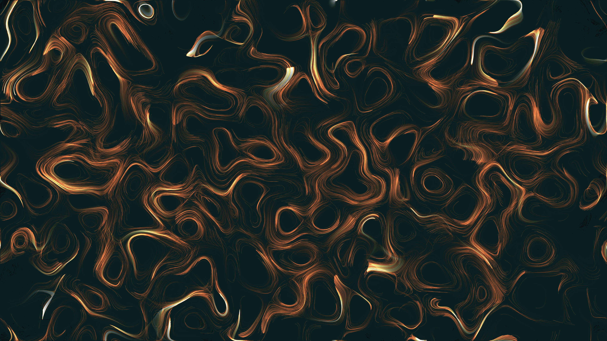

# kinetic_curl_noise_vortex_flow_2d

## Metadata
- **Date**: 2026-06-28
- **Theme**: An abstract fluid dynamics simulation using purely analytical "Curl Noise"
- **Technique**: This sketch defines a scalar potential field built from nested, oscillating sine and cosine waves. I derived the analytical partial derivatives of that field to create an incompressible vector field. Then, I vectorized 1,000,000 particles and mapped them to the velocity field using Euler integration.  To draw the millions of points efficiently, a highly optimized bucketing technique splits the particles by their dominant color channel and draws them using just 3 large `py5.points()` calls per frame. Additive blending allows the overlapping particle trails to build up a beautifully intense glow.
- **Logic Lab Reference**: 

## Concept
An abstract fluid dynamics simulation using purely analytical "Curl Noise". Curl noise calculates velocity vectors by taking the cross-product derivative of a mathematical scalar field. Because of the math involved, the resulting vector flow field is perfectly incompressible—meaning particles will trace out stunning, non-intersecting vortex lines and never clump together!

## Technical Details
- **Renderer**: Unknown
- **Simulation**: Unknown
- **Visuals**: Unknown
- **Animation**: Contains animation details
