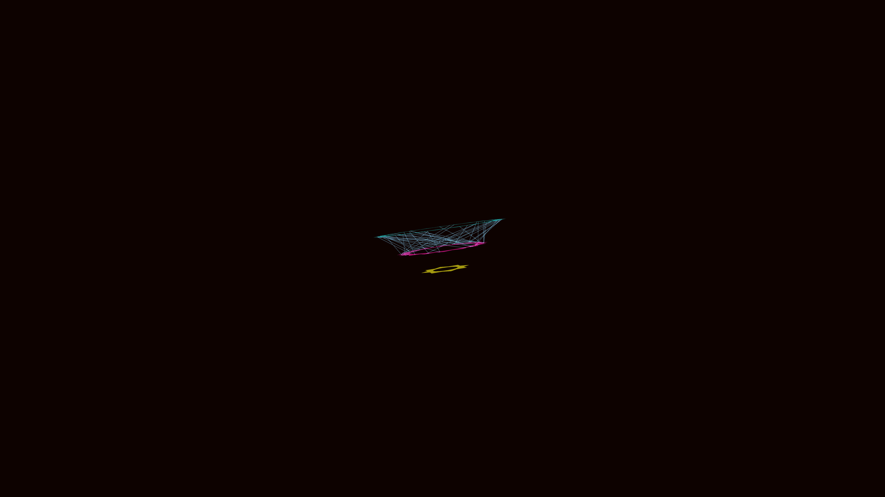

# kinetic_cybernetic_mandala_gear_3d

## Details
- **Date**: 2026-06-07
- **Theme**: A hypnotic, multi-layered cybernetic mandala built from interlocking, independently rotating 3D gears connected by sparking tissue.
- **Technique**: Procedurally generated 3D polar geometries consisting of stacked counter-rotating gears rendered with additive blending and neon cyan/magenta glow.
- **Palette**: Obsidian black background, neon cyan and magenta dominant, intense white accents.

## Media

