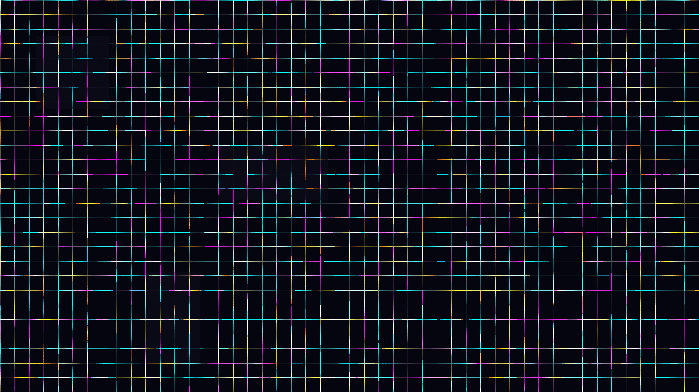

# kinetic_cyberpunk_data_cityscape_2d

## Metadata
- **Date**: 2026-06-30
- **Theme**: A dense, top-down view of a massive cyberpunk city grid
- **Technique**: This sketch uses a grid-based procedural routing system. Instead of free-floating particles, 2,000 glowing data streams traverse orthogonal grid paths, making sharp 90-degree turns when they reach intersections. `py5.blend_mode(py5.ADD)` is used extensively to cause overlapping neon lines to flash bright white when they intersect, simulating energy spikes. The faint, dark background features subtle geometric rectangles that suggest monolithic city buildings or microchip architecture.
- **Logic Lab Reference**: 

## Concept
A dense, top-down view of a massive cyberpunk city grid. Glowing data packets pulse and stream through intricate, labyrinthine circuit-like city blocks, evoking the feeling of a massive, high-speed futuristic data network.

## Technical Details
- **Renderer**: Unknown
- **Simulation**: Unknown
- **Visuals**: Unknown
- **Animation**: Contains animation details
