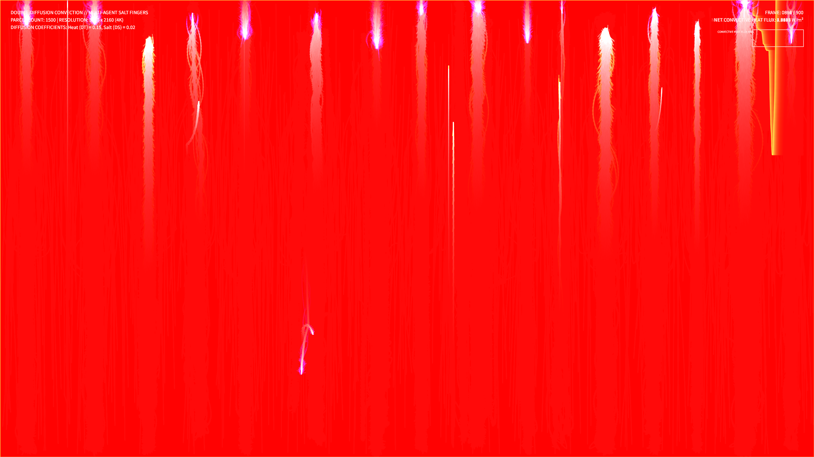

# kinetic_double_diffusion_convection_2d

## Metadata
- **Date**: 2026-08-14
- **Theme**: Thermal convection currents exchanging heat in a dark sea, forming vertical interlacing fingers of rising warmth and sinking cold.
- **Technique**: Double-diffusion convection particle simulation.
- **Logic Lab Reference**: None

## Concept
A physics-driven fluid convection visualization illustrating double-diffusive instabilities (salt fingering). The model simulates 1,500 active fluid parcel agents possessing Temperature (T) and Salinity (S). Buoyancy forces proportional to density differences drive warm/fresh parcels upwards and cold/salty parcels downwards. When parcels collide, they exchange T and S via localized diffusion (where heat diffuses much faster than salt). This creates convective shear, rolling up parcels into interlacing vertical fingers of warm orange and cold cyan light.

## Technical Details
- **Renderer**: P2D
- **Simulation**: Vectorized buoyancy force equations, neighbor-based local heat/salt diffusion, and collision repulsion in NumPy.
- **Visuals**: Dynamic HSB color mapping dependent on local Temperature (orange to violet to cyan), additive blending (`py5.ADD`), and low-alpha trails for long-exposure convection currents.
- **Animation**: 15 seconds @ 60fps (900 frames total). Includes real-time Convective Heat Flux telemetry HUD.
