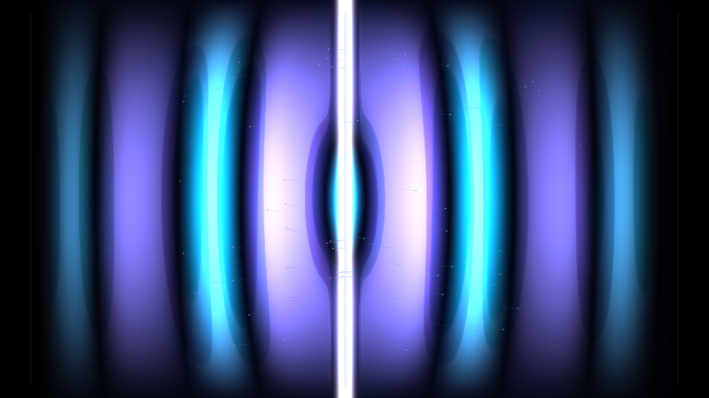

# kinetic_dynamical_casimir_vacuum_radiation_2d

A 15-second kinetic media art piece simulating the Dynamical Casimir Effect (DCE): the generation of real, entangled photon pairs from zero-point quantum vacuum fluctuations via a relativistic oscillating boundary mirror.

## Concept & Physics

In quantum field theory, the vacuum ground state $|0\rangle$ is not empty space, but a seething sea of virtual particle-antiphoton pairs continuously fluctuating into and out of existence. In 1970, Gerald Moore predicted that if an uncharged conducting boundary (mirror) is accelerated at relativistic velocities ($v \sim c$), the non-adiabatic modulation of electromagnetic boundary conditions prevents virtual photon pairs from recombining.

Through Bogoliubov transformations of the field modes, virtual vacuum fluctuations are converted into pairs of **real, correlated, entangled photons**:

$$\langle N_k \rangle = \sum_{k'} |\beta_{k, k'}|^2 \propto \left( \frac{v_{max}}{c} \right)^2 \sinh^2(r_k)$$

When driven parametrically at frequency $\omega_0 \approx 2\omega_{rad}$, the cavity field undergoes two-mode quadrature squeezing, radiating entangled photon pairs symmetrically into the adjacent vacuum cavities.

## Visual Dynamics

- **Relativistic Oscillating Mirror**: A central conducting blade vibrating at high frequency with relativistic acceleration peaks.
- **Squeezed Radiation Wavefronts**: Alternating parabolic electromagnetic wave crests in electric cyan and cosmic amethyst-violet rippling outward from the mirror.
- **Entangled Photon Pairs**: Correlated photon pairs spawned at peak acceleration turning points, flying outward in opposite directions with glowing velocity streaks.
- **Quantum Entanglement Filaments**: Delicate luminescent catenary filaments linking twin photons as they separate across the mirror boundary.
- **Liquid Chrome Specular Glints**: Blinn-Phong specular lighting reflecting off the curved electromagnetic wave crests.

## Color Palette

- **Mirror Core & Parametric Flash** (`#ffffff`, `#e0e7ff`, `#f472b6`): Incandescent diamond-white mirror blade, emission nodes, and twin photon sparks (10%).
- **Squeezed Wavefront Crests** (`#06b6d4`, `#38bdf8`, `#6366f1`, `#818cf8`): Radiant electric cyan and cosmic indigo-violet electromagnetic wavefronts (30%).
- **Quantum Vacuum Ground State** (`#02040a`, `#050814`, `#0a1024`): Deep non-excited vacuum void (60%).

## Technical Implementation

- **Platform**: py5 (Python Processing architecture)
- **Field Simulation**: 2D continuous wavefield formulation modeling parametric drive, transverse cavity modes, and relativistic boundary modulation on a 800×450 grid.
- **Optics**: Normal-mapped Blinn-Phong specular glinting coupled with ARGB pixel buffer compilation.
- **Output**: 1920×1080 @ 60fps (900 frames, 15 seconds), H.264 video.
