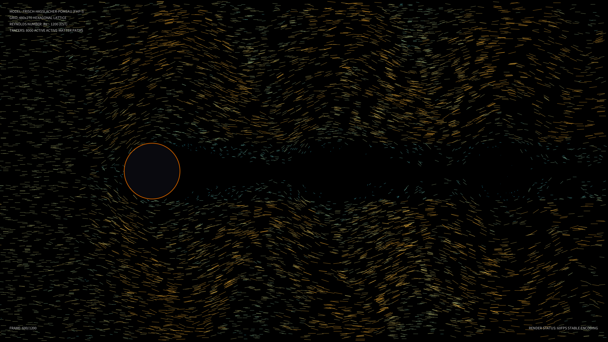

# kinetic_fhp_lattice_gas_fluid_2d

## Metadata
- **Date**: 2026-08-20
- **Theme**: Fluid flow around a circular cylinder in a microscopic, hexagonal particle world, showing macroscopic vortex shedding and turbulence.
- **Technique**: Frisch-Hasslacher-Pomeau (FHP-I) Hexagonal Lattice Gas Automaton
- **Logic Lab Reference**: None

## Concept
A visualization of fluid dynamics in a discrete universe. By simulating millions of microscopic particles colliding on a hexagonal grid, macroscopic fluid phenomena emerge naturally. The work illustrates the transition from microscopic rules to macroscopic beauty, showing stable vortices shedding in the wake of a cylinder (Kármán vortex street) in glowing neon hues.

## Technical Details
- **Renderer**: P2D (using py5 upscaled buffer drawing)
- **Simulation**: Vectorized FHP-I lattice gas simulation with periodic boundaries and bounce-back obstacle conditions computed in NumPy.
- **Visuals**: Density-mapped background glow, glowing neon path lines, speed-modulated color gradients, and dynamic cybernetic telemetry.
- **Animation**: 20 seconds @ 60fps
