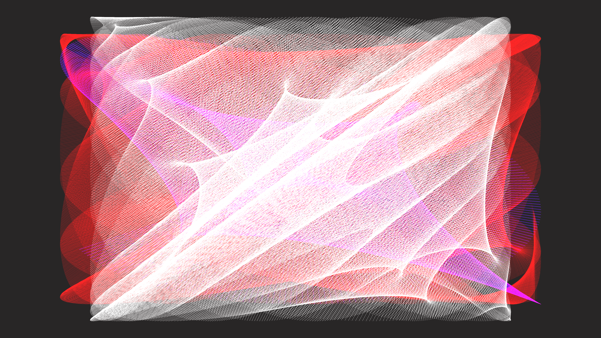

# kinetic_fiber_optic_string_weaving_2d

## Metadata
- **Date**: 2026-06-30
- **Theme**: A kinetic visualization of thousands of glowing fiber optic strings weaving a complex geometric tape
- **Technique**: Unknown
- **Logic Lab Reference**: 

## Concept
A kinetic visualization of thousands of glowing fiber optic strings weaving a complex geometric tapestry. The lines trace along the boundaries of the canvas, continuously shifting their anchor points to generate an intricate, breathing moiré and 3D illusion in the center.

## Technical Details
- **Renderer**: Unknown
- **Simulation**: Unknown
- **Visuals**: Unknown
- **Animation**: Contains animation details
