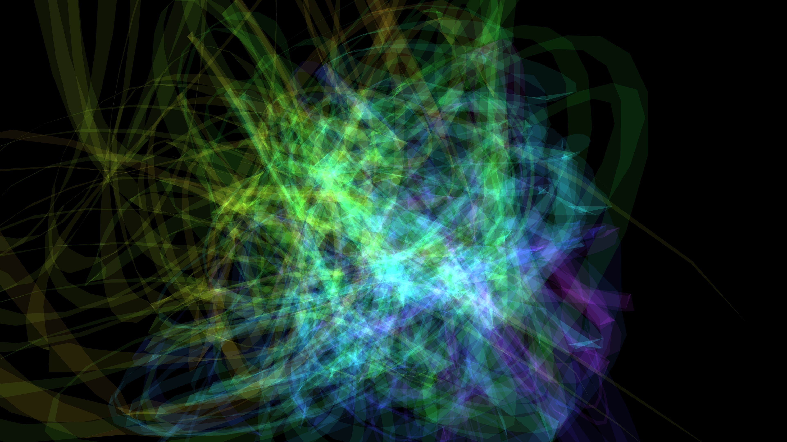

# kinetic_fluid_glass_ribbons_3d

Smooth, semi-transparent glass ribbons flowing and twisting like liquid through zero-gravity space.

## Details
- **Date**: 2026-06-20
- **Technique**: 3D triangle strips governed by a curl-noise field, with low alpha and additive blending to create overlapping iridescent layers.
- **Format**: Animation (15s @ 60fps)
