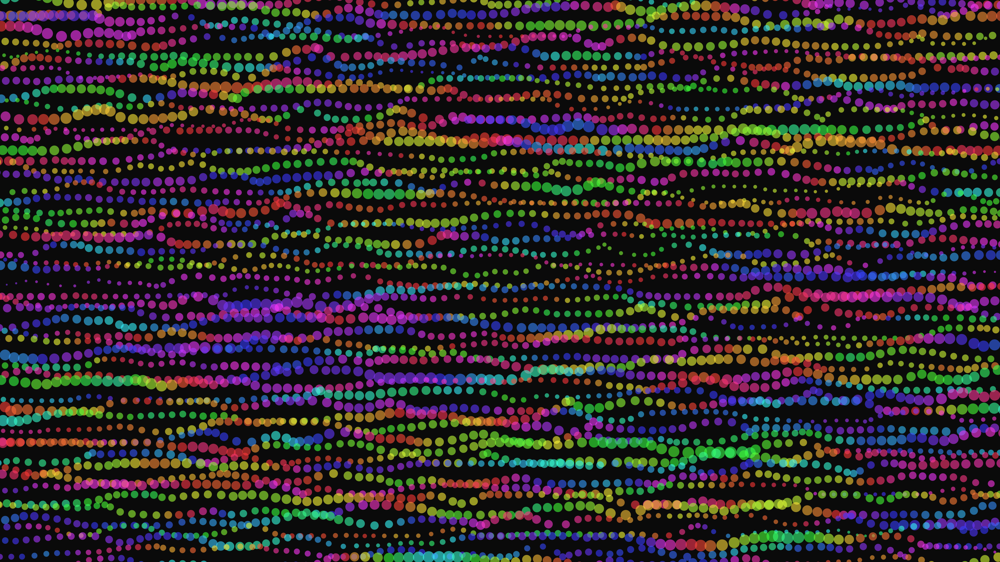

# kinetic_fluid_plasma_field_2d

## Metadata
- **Date**: 2026-06-29
- **Theme**: A kinetic flow field driven by Perlin noise, creating a dynamic, glowing plasma simulation where flu
- **Technique**: Unknown
- **Logic Lab Reference**: 

## Concept
A kinetic flow field driven by Perlin noise, creating a dynamic, glowing plasma simulation where fluid-like particles move across the canvas, shifting hues through the neon spectrum.

## Technical Details
- **Renderer**: Unknown
- **Simulation**: Unknown
- **Visuals**: Unknown
- **Animation**: - `kinetic_fluid_plasma_field_2d.mp4` - `kinetic_fluid_plasma_field_2d_p1.png`
