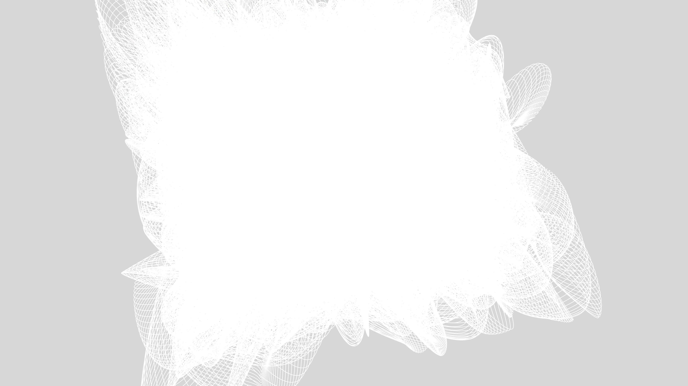

# kinetic_fluid_string_theory_vibrations_3d

## Metadata
- **Date**: 2026-06-17
- **Theme**: A 3D animation representing an abstract view of 11-dimensional string theory, where complex, multi-c
- **Technique**: Uses multiple `py5.curve_vertex` loops with radii and offsets driven by high-frequency `py5.os_noise` and sine waves. This generates erratic but structured fluid vibrations in 3D space. Combined with an additive blending color palette and a rotating camera orbit, it creates an immersive topology.
- **Logic Lab Reference**: 

## Concept
A 3D animation representing an abstract view of 11-dimensional string theory, where complex, multi-colored neon loops intersect, vibrate, and form fluid topological structures.

## Technical Details
- **Renderer**: Unknown
- **Simulation**: Unknown
- **Visuals**: Unknown
- **Animation**: Unknown
