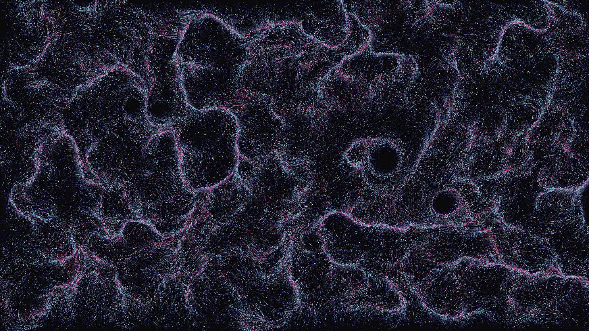

# kinetic_fluid_vortex_advection_2d

## Metadata
- **Date**: 2026-08-09
- **Theme**: Glowing ink currents dancing in a deep abyss, caught in a swirling vortex structure.
- **Technique**: Vectorized particle advection field driven by multiple localized vortex nodes and Perlin noise.

## Concept
A quiet dark space that quickly bursts with elegant, thin wisps of glowing cyan and indigo ink. The ink particles are swept up by attractive vortex centers, tracing orbital paths and leaving delicate, decaying trails that simulate light emission in a deep void.

## Technical Details
- **Renderer**: Custom direct-pixel rendering using `py5.np_pixels`
- **Simulation**: Vectorized NumPy computations calculating particle velocities based on vortex fields and Perlin noise
- **Visuals**: Dynamic color mapping linking particle age to color phases (Indigo -> Aqua -> Coral/Gold) with semi-transparent canvas overlays for smooth glowing trails
- **Animation**: 15 seconds @ 60 FPS (900 frames)
