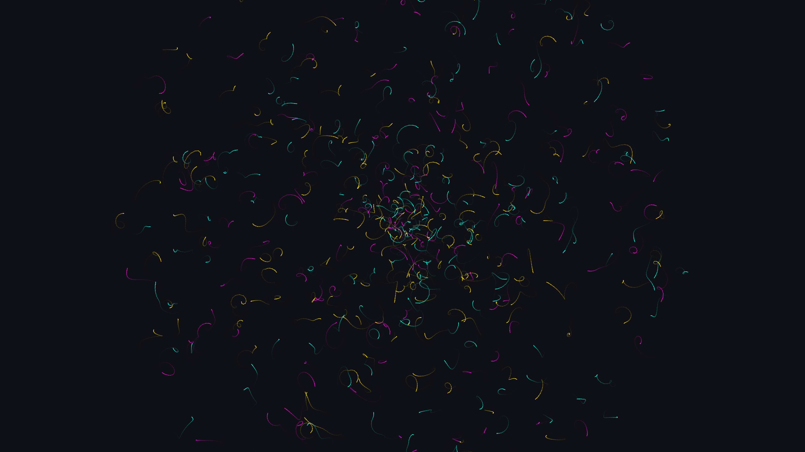

# kinetic_fourier_epicycle_mandala_2d

## Metadata
- **Date**: 2026-07-01
- **Theme**: An animated sequence of 500 overlapping mathematical mandalas generated purely through complex Fouri
- **Technique**: Unknown
- **Logic Lab Reference**: 

## Concept
An animated sequence of 500 overlapping mathematical mandalas generated purely through complex Fourier epicycles. The overlapping structures breathe, spin, and expand continuously, leaving luminous neon paths in their wake.

## Technical Details
- **Renderer**: Unknown
- **Simulation**: Unknown
- **Visuals**: Unknown
- **Animation**: Contains animation details
