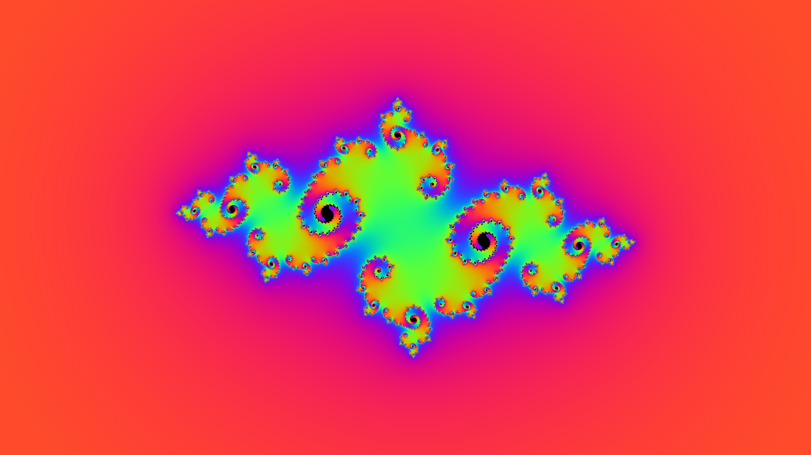

# kinetic_fractal_julia_set_morph_2d

## Metadata
- **Date**: 2026-07-01
- **Theme**: A mesmerizing generative animation diving into the mathematics of the Julia Set ($z_{n+1} = z_n^2 + 
- **Technique**: Unknown
- **Logic Lab Reference**: 

## Concept
A mesmerizing generative animation diving into the mathematics of the Julia Set ($z_{n+1} = z_n^2 + c$).

## Technical Details
- **Renderer**: Unknown
- **Simulation**: Unknown
- **Visuals**: Unknown
- **Animation**: Contains animation details
