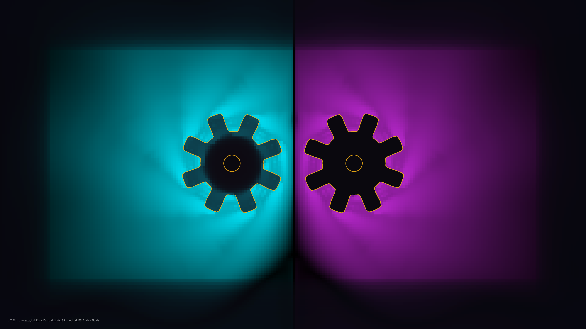

# kinetic_gear_churn_stable_fluids_2d

A 4K kinetic visualization of fluid-structure interaction, where rotating mechanical gears churn bioluminescent fluid currents in a dark void.

## Concept

This artwork couples a vectorized 2D Stable Fluids Navier-Stokes solver with moving solid boundaries. Two mechanical gears rotate in opposite directions:
- **Left Gear**: Rotates clockwise, introducing Electric Cyan dye.
- **Right Gear**: Rotates counter-clockwise, introducing Neon Amethyst dye.

As the gears rotate, they enforce a solid-body velocity constraint inside their masks:
$$\mathbf{u}_{\text{solid}} = (-\omega(y - y_c), \omega(x - x_c))$$
This velocity is injected into the fluid solver, transferring torque and generating complex turbulent shear eddies, wakes, and vortex streets. The gears are rendered as crisp vector drawings on top of the fluid, highlighting the interface between mechanical structure and organic flow.

## Techniques

- **Fluid-Structure Interaction (FSI)**: Forces the fluid velocity grid inside moving solid masks to match the local boundary velocity of rotating gears at each time step.
- **Analytical Gear Geometry**: Models the gear boundaries analytically in polar coordinates using a smoothed tanh-step function to represent gear teeth.
- **Stable Fluids Navier-Stokes Solver**: Solves the incompressible Navier-Stokes equations using Semi-Lagrangian advection and Jacobi pressure projection on a periodic grid.
- **Dual Dye Color Advection**: Advects and diffuses independent RGB dye channels to trace the mixing paths of the two distinct currents.
- **4K Upscaling**: Dynamic bilinear expansion from the simulation grid to 3840×2160 pixels.

## Palette

- **Background**: Obsidian Abyss (near black, 10, 8, 14)
- **Dominant**: Electric Cyan (fluid dye, 0, 220, 240)
- **Secondary**: Neon Amethyst (fluid dye, 180, 40, 200)
- **Accent**: Solar Gold (gears and telemetry, 250, 180, 20)
