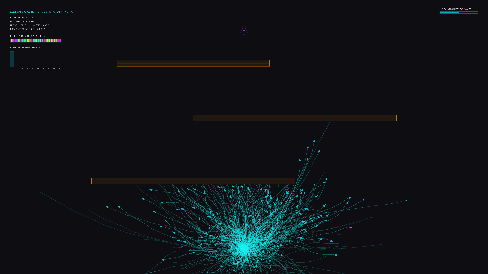

# kinetic_genetic_pathfinder_rockets_2d

## Metadata
- **Date**: 2026-08-03
- **Theme**: Natural selection, pathfinding, genetic algorithms, cybernetic adaptation
- **Technique**: Genetic algorithm simulation (200 agents, 240-frame DNA, crossover & mutation), offscreen graphics trail buffer, real-time HSB DNA chromosome gene sequence maps, fitness distribution HUD charts, and laboratory HUD.
- **Logic Lab Reference**: [smart_rockets.py](file:///Users/asami/develop/art/logic-lab/src/logic_lab/genetic_algorithms/smart_rockets/smart_rockets.py)

## Concept
This artwork visualizes the power of evolutionary search. A population of 200 rocket-like probes attempts to navigate from the bottom of the screen to a gravity well (target) at the top. They are blocked by three layers of glowing horizontal force fields containing narrow, misaligned slits.
Each probe is driven by a unique DNA sequence of force vectors. In the first generation, their paths are completely chaotic. When a generation dies, the selection engine performs tournament selection, crossover, and mutation to breed the next generation.
Over 4 generations (960 frames), the paths evolve. The probes discover the slits, adapting their trajectories to form narrow, organized glowing streams that converge on the gravity well.
The HUD displays:
- **Best Chromosome Gene Sequence**: A horizontal ribbon visualizing the 240 force angles of the leading probe. As generations advance, this ribbon transitions from noisy static to smooth, structured gradients.
- **Population Fitness Profile**: A real-time histogram of fitness scores.
- **Telemetry**: Generation counts, success rates, and active steps.

## Technical Details
- **Renderer**: Java2D
- **Population**: 200 agents with 240-step DNA sequences.
- **Genetic Engine**: Tournament selection (size 5), single-point crossover, mutation rate 1.5%, and elite survival.
- **Visuals**: Offscreen graphics trail buffer with organic generation crossovers, 4K vector HUD graphics, and pulsing target rings.
- **Animation**: 16 seconds @ 60 FPS (960 frames)
