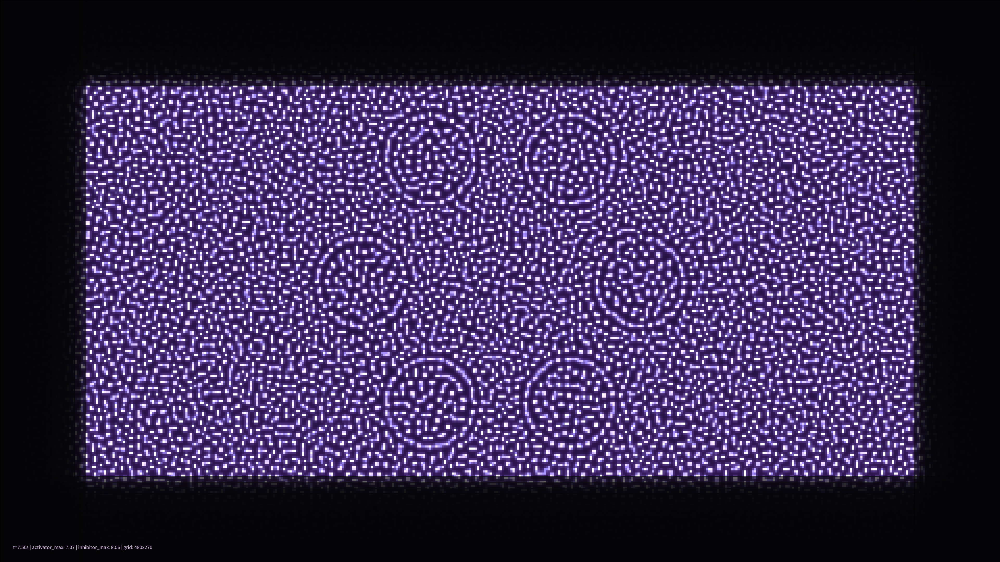

# kinetic_gierer_meinhardt_turing_2d

## Metadata
- **Date**: 2026-08-06
- **Theme**: Bioluminescent Morphogenesis
- **Technique**: Gierer-Meinhardt Reaction-Diffusion model on a 2D grid

## Concept
A 4K kinetic visualization of the Gierer-Meinhardt model, representing the emergence of biological structures and patterns. Glowing cyan and coral spots elongate, split, and fuse into intricate labyrinthine stripes, surrounded by faint purple inhibitor halos. The overall system feels like a living colony of deep-sea bioluminescent organisms pulsating in a dark, quiet abyss.

## Technical Details
- **Renderer**: Custom 2D NumPy direct pixel blitting (py5.np_pixels)
- **Simulation**: Vectorized 5-point stencil Laplacian finite-difference solver, explicit Euler integration
- **Visuals**: Dynamic feed rate/production modulation, HSB/RGB color blend mapping with activator-inhibitor intensity thresholds
- **Animation**: 15 seconds @ 60fps
